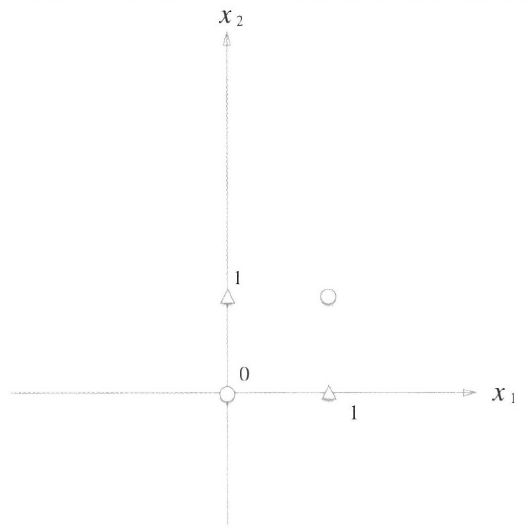
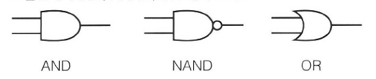
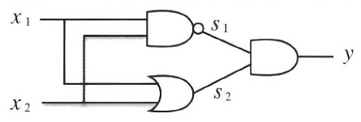

# Ch2 퍼셉트론
{: .no_toc }

<details open markdown="block">
  <summary>
    Toggle
  </summary>
## Table of contents
{: .no_toc .text-delta }

- TOC
{:toc}
</details>

---

- 프랑크 로젠블라트가 1957년에 고안한 알고리즘

- 신경망(딥러닝)의 기원이 되는 알고리즘

## 2.1 퍼셉트론이란

- 다수의 신호를 입력으로 받아 하나의 신호를 출력

- 0과 1 두 가지 값을 가짐

<div class="mermaid">
graph LR;
	x1((x1)); x2((x2)); y((y));
	x1 --w1-->y;
	x2 --w2-->y;
</div>

- $x_1$, $x_2$는 입력 신호, $y$는 출력 신호, $w_1$, $w_2$는 가중치

- 위의 원을 **뉴런** 혹은 **노드**라고 부름

- 입력 신호가 뉴런에 보내질 때는 각각 고유한 **가중치**$^{\text{weight}}$가 곱해짐($w_1x_1, w_2x_2$)

- 뉴런에서 보내온 신호의 총합이 정해진 한계를 넘어설 때만 1 출력

	- 뉴런이 활성화한다고 표현하기도 함

	- 한계를 **임계값**이라고 하며 $\theta$로 나타냄

<div>
$$
y = \begin{cases}
	0~(w_1x_1 + w_2x_2 \le \theta)\\
	1~(w_1x_1 + w_2x_2 > \theta)
	\end{cases}
$$
</div>

---

## 2.2 단순한 논리 회로

- 퍼셉트론을 표현하기 위해서는 퍼셉트론의 매개변수인 가중치와 임계값을 결정해야 한다.

### 2.2.1 AND 게이트

|x1|x2|y|
|-|-|-|
|0|0|0|
|1|0|0|
|0|1|0|
|1|1|1|

- $(w_1, w_2, \theta) = (0.5, 0.5, 0.7), (1.0, 1.0, 2.0), ...$ 무수히 많음

### 2.2.2 NAND 게이트와 OR 게이트

##### NAND 게이트
{: .no_toc }

|x1|x2|y|
|-|-|-|
|0|0|1|
|1|0|1|
|0|1|1|
|1|1|0|

- $(w_1, w_2, \theta) = (-0.5, -0.5, -0.7), ...$ 무수히 많음

- AND 게이트를 구현하는 매개변수의 부호를 반전하면 NAND 게이트가 된다.

##### OR 게이트
{: .no_toc }

|x1|x2|y|
|-|-|-|
|0|0|0|
|1|0|1|
|0|1|1|
|1|1|1|

- $(w_1, w_2, \theta) = (1.0, 1.0, 1.0), ...$ 무수히 많음

> **학습**이란 적절한 매개변수 값을 정하는 작업이다. 여기서는 인간이 진리표라는 학습데이터를 보면서 매개변수의 값을 결정했지만 기계학습에서는 컴퓨터가 학습데이터를 보고 자동으로 학습한다. 사람은 퍼셉트론의 구조(모델)을 고민하고 컴퓨터에 학습할 데이터를 주는 일을 한다.

- 퍼셉트론의 구조는 AND, NAND, OR 게이트에서 모두 똑같다.

- 같은 구조의 퍼셉트론에서 매개변수의 값만 적절히 조정하면 AND, NAND, OR이 된다.

---

## 2.3 퍼셉트론 구현하기

### 2.3.1 간단한 구현부터

##### AND 게이트 구현
{: .no_toc }

```python
def AND(x1, x2):
	w1, w2, theta = 0.5, 0.5, 0.7
	tmp = x1*w1 + x2*w2
	if tmp <= theta:
		return 0
	if tmp >= theta:
		return 1
```

```python
# interpreter
AND(0, 0)
AND(1, 0)
AND(0, 1)
AND(1, 1)
```

### 2.3.2 가중치와 편향 도입

<div>
$$
y = \begin{cases}
	0~(w_1x_1 + w_2x_2 \le \theta)\\
	1~(w_1x_1 + w_2x_2 > \theta)\\
	\end{cases}
$$
</div>

$\theta = -b$ 치환

<div>
$$
y = \begin{cases}
	0~(b + w_1x_1 + w_2x_2 \le 0)\\
	1~(b + w_1x_1 + w_2x_2 > 0)\\
	\end{cases}
$$
</div>

- $b$를 **편향**$^{\text{bias}}$이라고 한다.

```python
# interpreter
import numpy as np
x = np.array([0, 1])		# 입력
w = np.array([0.5, 0.5])	# 가중치
b = -0.7			# 편향
w*x
np.sum(w*x) + b
```

- 넘파이 배열끼리의 곱셈은 원소 수가 같다면 각 원소끼리 곱한다.

- `np.sum()` : 입력한 배열에 담긴 모든 원소의 총합 계산

### 2.3.3 가중치와 편향 구현하기

##### 가중치와 편향을 도입한 AND 게이트
{: .no_toc }

```python
import numpy as np

def AND(x1, x2):
	x = np.array([x1, x2])
	w = np.array([0.5, 0.5])
	b = -0.7
	tmp = np.sum(w*x) + b
	if tmp <= 0:
		return 0
	else:
		return 1
```

```python
# interpreter
AND(0, 0)
AND(1, 0)
AND(0, 1)
AND(1, 1)
```

- 가중치와 편향은 기능이 다르다는 사실에 주의!

	- 가중치는 각 입력 신호가 결과에 주는 영향력(중요도)을 조절하는 매개변수

	- 편향은 뉴런이 얼마나 쉽게 활성화(결과로 1을 출력)하느냐를 조정하는 매개변수

- $w_1$과 $w_2$는 가중치로, $b$는 편향으로 서로 구별하기도 하지만 문맥에 따라 셋 모두를 가중치라고 할 때도 있다.

> 편향이라는 용어는 '한쪽으로 치우쳐 균형을 깬다'라는 의미를 담고 있다.
> 실제로 두 입력이 모두 0이어도 결과로 편향 값을 출력한다.

##### NAND 게이트와 OR 게이트 구현
{: .no_toc }

```python
import numpy as np

def NAND(x1, x2):
	x = np.array([x1, x2])
	w = np.array([-0.5, -0.5])
	b = 0.7
	tmp = np.sum(w*x) + b
	if tmp <= 0:
		return 0
	else:
		return 1

def OR(x1, x2):
	x = np.array([x1, x2])
	w = np.array([0.5, 0.5])
	b = -0.2
	tmp = np.sum(w*x) + b
	if tmp <= 0:
		return 0
	else:
		return 1
```

```python
# interpreter
NAND(0, 0)
NAND(1, 0)
NAND(0, 1)
NAND(1, 1)
OR(0, 0)
OR(1, 0)
OR(0, 1)
OR(1, 1)
```

---

## 2.4 퍼셉트론의 한계

- 단층 퍼셉트론으로는 XOR 게이트를 표현할 수 없음

- 단층 퍼셉트론으로는 비선형 영역을 분리할 수 없음

### 2.4.1 XOR 게이트

|x1|x2|y|
|-|-|-|
|0|0|0|
|1|0|1|
|0|1|1|
|1|1|0|



- 직선 하나로 $\bigcirc$와 $\triangle$을 나눌 수 없다.

### 2.4.2 선형과 비선형

- 곡선이라면 $\bigcirc$와 $\triangle$을 나눌 수 있다.

- 곡선의 영역을 **비선형** 영역, 직선의 영역을 **선형** 영역이라고 함

- 퍼셉트론은 직선 하나로 나눈 영역만 표현할 수 있다는 한계가 있음

---

## 2.5 다층 퍼셉트론이 출동한다면

- 다층 퍼셉트론을 이용해서 XOR 표현

### 2.5.1 기존 게이트 조합하기

- AND, NAND, OR 게이트를 조합하여 XOR 구현





|x1|x2|s1|s2|y|
|-|-|-|-|-|
|0|0|1|0|0|
|1|0|1|1|1|
|0|1|1|1|1|
|1|1|0|1|0|

### 2.5.2 XOR 게이트 구현하기

```python
def XOR(x1, x2):
	s1 = NAND(x1, x2)
	s2 = OR(x1, x2)
	y = AND(s1, s2)
	return y
```

```python
# interpreter
XOR(0, 0)
XOR(1, 0)
XOR(0, 1)
XOR(1, 1)
```

- 뉴런을 이용한 퍼셉트론으로 표현

<div class="mermaid">
flowchart LR;
	x1((x1)); x2((x2)); s1((s1)); s2((s2)); y((y));
	x1 --> s1; x1 --> s2;
	x2 --> s1; x2 --> s2;
	s1 --> y;
	s2 --> y;

	subgraph f0[0층];
		x1; x2;
		end;
	subgraph f1[1층];
		s1; s2;
		end;
	subgraph f2[2층];
		y;
		end;
</div>

- 이처럼 층이 여러 개인 퍼셉트론을 다층 퍼셉트론이라고 한다.

- 층을 쌓아 퍼셉트론으로 다양한 것을 표현할 수 있음

> 위의 퍼셉트론은 총 3층으로 구성되지만 가중치를 갖는 층은 2개 뿐이므로 2층 퍼셉트론이라 부르기로 하자. 3층 퍼셉트론이라 하는 경우도 있다.

---

## 2.6 NAND에서 컴퓨터까지

- NAND 게이트만으로 컴퓨터 제작 가능 $\rightarrow$ 퍼셉트론으로 컴퓨터 제작 가능

- 퍼셉트론은 층을 거듭 쌓으면 비선형적인 표현도 가능하고 이론상 컴퓨터가 수행하는 처리도 표현 가능

---

## 2.7 정리

### 이번 장에서 배운 내용

- 퍼셉트론은 입출력을 갖춘 알고리즘이다. 입력을 주면 정해진 규칙에 따른 값을 출력한다.

- 퍼셉트론에서는 가중치와 편향을 매개변수로 설정한다.

- 퍼셉트론으로 AND, OR 게이트 등의 논리 회로를 표현할 수 있다.

- XOR 게이트는 단층 퍼셉트론으로는 표현할 수 없다.

- 2층 퍼셉트론을 이용하면 XOR 게이트를 표현할 수 있다.

- 단층 퍼셉트론은 직선형 영역만 표현할 수 있고, 다층 퍼셉트론으 ㄴ비선형 영영역도 표현할 수 있다.

- 다층 퍼셉트론은 (이론상) 컴퓨터를 표현할 수 있다.
