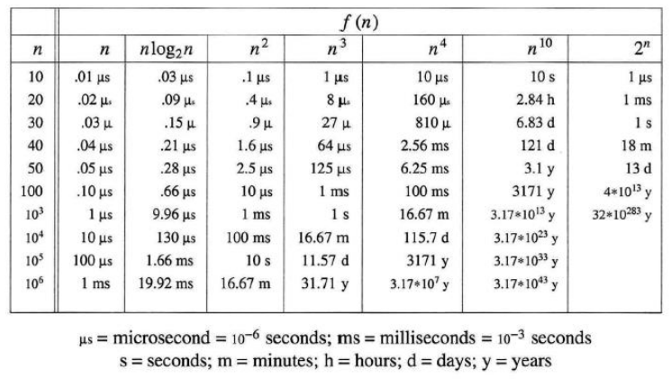

<style>
.map1 {
  background: #EEEEEE;
}
.map2 {
  background: #EEEEFF;
}
.map3 {
  background: #EEFFEE;
}
.map2_2 {
  background: #DDDDFF;
}
.map2_3 {
  background: #EEFFFF;
}
.map2_2_2 {
  background: #CCCCFF;
}
td {
  text-align: center;
}
th {
  text-align: center;
}
</style>

# Ch1 Basic Concept
{: .no_toc }

<details markdown="block">
  <summary>
	Table of contents
  </summary>
{: .fs-3 .text-delta }
- TOC
{:toc}
</details>

---

## 1.2 Pointers and Dynamic Memory Allocation

### 1.2.1 Pointers

- For any type T in C, there is a corresponding type pointer-to-T

- pointer type은 해당 변수가 저장된 주소를 저장한다.

- Two operators used with the Pointers

	- `&`: Address operator

	- `*`: Dereferencing(or indirection) operator

	```c
	int i, *pi;
	pi = &i;

	// To assign a value 10 to i
	i = 10;
	or
	*pi = 10;
	```

- Null pointer

	- Represented by the integer 0

	- Points to no object or function

	```c
	int *pi = 0;
	```

	```c
	// To test null pointer
	if (pi == NULL) ...
	if (!pi) ...
	```

### 1.2.2 Dynamic Memory Allocation

- When is it required?

	1. run time에서 필요할 때 메모리를 할당했다가 필요하지 않으면 해제하여 메모리를 효율적으로 사용할 수 있다.

	2. 일반 변수나 함수의 경우 stack에 할당되는데 동적할당은 heap에 할당되어 별도로 관리된다.

- Allocating storage at run-time

	- called heap mechanism

	- Using a function, malloc

```c
// Program 1.1: Allocation and deallocation of memory
int i, *pi;
float f, *pf;
pi = (int *)malloc(sizeof(int));
pf = (float *)malloc(sizeof(float));
*pi = 1024;
*pf = 3.14;
printf("an integer = %d, a float = %f\n", *pi, *pf);
free(pi);
free(pf);
```

- More robust version for `malloc()`

```c
if ((pi=(int *)malloc(sizeof(int))) == NULL || (pf=(float *)malloc(sizeof(float))) == NULL) {
	fprintf(stderr, "Insufficient memory");
	exit(EXIT_FAILURE);
}
```

or by the equivalent code

```c
if (!(pi=malloc(sizeof(int))) || !(pf=malloc(sizeof(float)))) {
	fprintf(stderr, "Insufficient memory");
	exit(EXIT_FAILURE);
}
```

- A macro definition for `malloc()`

```c
#define IS_NULL(p) (!(p))
#define MALLOC(p, s) \
	p = malloc(s); \
	if (IS_NULL(p)) {\
		fprintf(stderr, "Insufficient memory"); \
		exit(EXIT_FAILURE); \
	}

MALLOC(pi, sizeof(int));
MALLOC(pf, sizeof(float));
```

- Dangling reference

```c
int i, *pi;
float f, *pf;
pi = (int *)malloc(sizeof(int));
pf = (float *)malloc(sizeof(float));
*pi = 1024;
*pf = 3.14;
printf("an integer = %d, a float = %f\n", *pi, *pf);
free(pi);
free(pf);
```

```c
pf = (float *)malloc(sizeof(float));
```

	- 유효하지 않은 공간을 참조

### 1.2.3 Pointers Can Be Dangerous

- Why?

	- 사용하면 안 되는 공간을 가리킬 수 있기 때문에 오작동 가능성이 높다.

- Set all pointers to NULL when they are not actually pointing to an object

- Explicit type cast when converting between pointer types

```c
int *pi;
float *pf;
pi = malloc(sizeof(int));
pf = (float *)pi;
```

---

## 1.3 Algorithm Specification

### 1.3.1 Introduction

- Algofithm is a finite set of instructions that accomplishes a particular task

- All algorithms must satisfy the following criteria

	1. Input: There are zero or more quantities that are externally supplied.

	2. Output: At least one quantity is produced.

	3. Definiteness: Each instruction is clear and unambiguous.

	4. Finiteness: If we trace out the instructions of an algorithm, then for all cases, the algorithm terminates after a finite number of steps.

	5. Effectiveness: Every instruction must be basic enough to be carried out in principle. It is not enough that each that each operation be definite as in (3); it also must be feasible.

- How to describe an algorithm?

	- Use a natural language like English

	- Use graphic representations called flowcharts

	- Here, we use mostly in C

		- Occasionally in a combination of English and C

- How to translating a problem into an algorithm?

	- Ex 1.1, Ex 1.2

##### Ex 1.1

- Devise a program that sorts a set of $n \ge 1$ integers

<table>
	<thead>
		<tr>
			<th>index</th>
			<td>0</td>
			<td>1</td>
			<td>2</td>
			<td>3</td>
			<td>4</td>
			<td>5</td>
			<td>6</td>
		</tr>
	</thead>
	<tbody>
		<tr>
			<th>value</th>
			<td>42</td>
			<td>16</td>
			<td>84</td>
			<td>12</td>
			<td>77</td>
			<td>26</td>
			<td>53</td>
		</tr>
	</tbody>
</table>

- A simple soluthon? [**selection sort**]

	- Find the smallest from those integers that are currently unsorted

	- Place it next in the sorted list

- Assume that integers are stored in array `list[i]`

	- $0<i<n$

```c
// Program 1.2: Selection sort algorithm
for (i=0;i<n;i++) {
	Examine list[i] to list[n-1] and suppose that the smallest integer is at list[min];
	Interchange list[i] and list[min];
}
```

- Two subtasks for a real C program

	- Find the smallest integer in `list`

	- Interchange `list[i]` and `list[min]`

- Find the smallest integer in `list`

	- `list[i]`가 minimum이라고 가정하고 탐색하며 더 작은 수가 나오면 minimum을 해당 값으로  바꾼다.

- Interchanging `list[i]` and `list[min]`

	- Function

		- Using the function, suppose `x` and `y` are declared as `int`s

	```c
	// Program 1.3: Swap function
	void swap(int *x, int *y) {
	// both parameters are pointers to ints
		int temp = *x;  // declares temp as an int and assigns to it the contents of what x points to
		*x = *y;  // stores what y points to into the location where x points
		*y = temp;  // places the contents of temp in location pointed to by y
	}

	swap(&a, &b);
	```

	- Macro

		- The macro works with any data type

	```c
	#define SWAP(x, y, t) ((t)=(x), (x)=(y), (y)=(t))
	```

	```c
	#define SWAP(a, b, type) do { \
		type temp; \
		temp = a;  \
		a = b;     \
		b = temp;  \
	} while(0)
	```

```c
// Program 1.4: Selection sort
#include <stdio.h>
#include <math.h>

#define SWAP(a, b, type) do { \
	type temp; \
	temp = a;  \
	a = b;     \
	b = temp;  \
} while(0)
#define MAX_SIZE 101

void sort(int [], int);  // selection sort

int main() {
	int i, n;
	int list[MAX_SIZE];

	printf("Enter the number of numbers to generate: ");
	scanf("%d", &n);

	if (n<1 || n>MAX_SIZE) {
		fprintf(stderr, "Improper value of n\n");
		exit(EXIT_FAILURE);
	}

	// randomly generate numbers
	for (i=0;i<n;i++) {
		list[i] = rand() % 1000;
		printf("%d ", list[i]);
	}

	sort(list, n);

	printf("\nSorted array:\n");
	for (i=0;i<n;i++)
		printf("%d ", list[i]);
	printf("\n");

	return 0;
}

void sort(int list[], int n) {
	int i, j, min;
	for (i=0;i<n-1;i++) {
		min = i;
		for (j=i+1;j<n;j++) {
			if (list[j] < list[min])
				min = j;
		}
		SWAP(list[i], list[min], int);
	}
}
```

- Example

<table>
	<thead>
		<tr>
			<th>index</th>
			<td>0</td>
			<td>1</td>
			<td>2</td>
			<td>3</td>
			<td>4</td>
			<td>5</td>
			<td>6</td>
		</tr>
	</thead>
	<tbody>
		<tr>
			<th>value</th>
			<td>42</td>
			<td>16</td>
			<td>84</td>
			<td>12</td>
			<td>77</td>
			<td>26</td>
			<td>53</td>
		</tr>
	</tbody>
</table>

<table>
	<thead>
		<tr>
			<th>index</th>
			<td class="map2">0</td>
			<td>1</td>
			<td>2</td>
			<td class="map3">3</td>
			<td>4</td>
			<td>5</td>
			<td>6</td>
		</tr>
	</thead>
	<tbody>
		<tr>
			<th>value</th>
			<td class="map2">42</td>
			<td>16</td>
			<td>84</td>
			<td class="map3">12</td>
			<td>77</td>
			<td>26</td>
			<td>53</td>
		</tr>
	</tbody>
</table>

<table>
	<thead>
		<tr>
			<th>index</th>
			<td class="map1">0</td>
			<td class="map2_3">1</td>
			<td>2</td>
			<td>3</td>
			<td>4</td>
			<td>5</td>
			<td>6</td>
		</tr>
	</thead>
	<tbody>
		<tr>
			<th>value</th>
			<td class="map1">12</td>
			<td class="map2_3">16</td>
			<td>84</td>
			<td>42</td>
			<td>77</td>
			<td>26</td>
			<td>53</td>
		</tr>
	</tbody>
</table>

<table>
	<thead>
		<tr>
			<th>index</th>
			<td class="map1">0</td>
			<td class="map1">1</td>
			<td class="map2">2</td>
			<td>3</td>
			<td>4</td>
			<td class="map3">5</td>
			<td>6</td>
		</tr>
	</thead>
	<tbody>
		<tr>
			<th>value</th>
			<td class="map1">12</td>
			<td class="map1">16</td>
			<td class="map2">84</td>
			<td>42</td>
			<td>77</td>
			<td class="map3">26</td>
			<td>53</td>
		</tr>
	</tbody>
</table>

<table>
	<thead>
		<tr>
			<th>index</th>
			<td class="map1">0</td>
			<td class="map1">1</td>
			<td class="map1">2</td>
			<td class="map2_3">3</td>
			<td>4</td>
			<td>5</td>
			<td>6</td>
		</tr>
	</thead>
	<tbody>
		<tr>
			<th>value</th>
			<td class="map1">12</td>
			<td class="map1">16</td>
			<td class="map1">26</td>
			<td class="map2_3">42</td>
			<td>77</td>
			<td>84</td>
			<td>53</td>
		</tr>
	</tbody>
</table>

<table>
	<thead>
		<tr>
			<th>index</th>
			<td class="map1">0</td>
			<td class="map1">1</td>
			<td class="map1">2</td>
			<td class="map1">3</td>
			<td class="map2">4</td>
			<td>5</td>
			<td class="map3">6</td>
		</tr>
	</thead>
	<tbody>
		<tr>
			<th>value</th>
			<td class="map1">12</td>
			<td class="map1">16</td>
			<td class="map1">26</td>
			<td class="map1">42</td>
			<td class="map2">77</td>
			<td>84</td>
			<td class="map3">53</td>
		</tr>
	</tbody>
</table>

<table>
	<thead>
		<tr>
			<th>index</th>
			<td class="map1">0</td>
			<td class="map1">1</td>
			<td class="map1">2</td>
			<td class="map1">3</td>
			<td class="map1">4</td>
			<td class="map2">5</td>
			<td class="map3">6</td>
		</tr>
	</thead>
	<tbody>
		<tr>
			<th>value</th>
			<td class="map1">12</td>
			<td class="map1">16</td>
			<td class="map1">26</td>
			<td class="map1">42</td>
			<td class="map1">53</td>
			<td class="map2">84</td>
			<td class="map3">77</td>
		</tr>
	</tbody>
</table>

<table>
	<thead>
		<tr>
			<th>index</th>
			<td class="map1">0</td>
			<td class="map1">1</td>
			<td class="map1">2</td>
			<td class="map1">3</td>
			<td class="map1">4</td>
			<td class="map1">5</td>
			<td class="map2">6</td>
		</tr>
	</thead>
	<tbody>
		<tr>
			<th>value</th>
			<td class="map1">12</td>
			<td class="map1">16</td>
			<td class="map1">26</td>
			<td class="map1">42</td>
			<td class="map1">53</td>
			<td class="map1">77</td>
			<td class="map2">84</td>
		</tr>
	</tbody>
</table>

> #define SQUARE(x) (x\*x)
> vs
> #define SQUARE(x) ((x)\*(x))

##### Ex 1.2

- Assume that we have $n$ distinct integers that are already sorted and stored in the array list.

<table>
	<thead>
		<tr>
			<th>index</th>
			<td>0</td>
			<td>1</td>
			<td>2</td>
			<td>3</td>
			<td>4</td>
			<td>5</td>
			<td>6</td>
			<td>7</td>
			<td>8</td>
		</tr>
	</thead>
	<tbody>
		<tr>
			<th>value</th>
			<td>20</td>
			<td>35</td>
			<td>37</td>
			<td>40</td>
			<td>45</td>
			<td>50</td>
			<td>51</td>
			<td>55</td>
			<td>67</td>
		</tr>
	</tbody>
</table>

- Figure out if an integer searchnum is in list

	- If it is in list, return its index `i`

	- If it is not present, return -1

- A Solution: [**Binary Search**]

	- Compare `list[middle]` with `searchnum`

		1. searchnum < list[middle]

			right = middle-1

		2. serchnum = list[middle]

			return middle

		3. searchnum > list[middle]

			left = middle+1

	```c
	// Program 1.5: Searching a sorted list
	while (there are more integers to check) {
		middle = (left+right)/2;
		if (searchnum < list[midlle])
			right = middle-1;
		else if (searchnum == list[middle])
			return middle;
		else
			left = middle+1;
	}
	```

- Algorithm contains two subtasks

	1. determining if there are any integers left to check

	2. comparing `searchnum` to `list[middle]`

1. determining if there are any integers left to check

	```c
	while (left <= right)
	```

2. comparing `searchnum` to `list[middle]`

	- Function

		- Using the function, suppose `x` and `y` are declared as `int`s

	```c
	// Program 1.6: Comparison of two integers
	int compare(int x, int y) {
	// compare x and y, return -1 for less than, 0 for equal, 1 for greater
		if (x < y)
			return -1;
		else if (x == y)
			return 0;
		else
			return 1;
	}
	```

	- Macro

		- The macro works with any data type

	```c
	#define COMPARE(x, y) (((x) < (y)) ? -1 : ((x)==(y)))?0:1)
	```

```c
// Program 1.7: Searching an ordered list
int binsearch(int list[], int searchnum, int left, int right) {
	int middle;
	while (left <= right) {
		middle = (left+right)/2;
		switch (COMPARE(list[middle], searchnum)) {
			case -1:
				left = middle+1;
				break;
			case 0:
				return middle;
			case 1:
				right = middle-1;
		}
	}
	return -1;
}
```

- Example 1. Search for the value 37

	<table>
		<thead>
			<tr>
				<th>index</th>
				<td>0</td>
				<td>1</td>
				<td>2</td>
				<td>3</td>
				<td>4</td>
				<td>5</td>
				<td>6</td>
				<td>7</td>
				<td>8</td>
			</tr>
		</thead>
		<tbody>
			<tr>
				<th>value</th>
				<td>20</td>
				<td>35</td>
				<td>37</td>
				<td>40</td>
				<td>45</td>
				<td>50</td>
				<td>51</td>
				<td>55</td>
				<td>67</td>
			</tr>
		</tbody>
	</table>

	<table>
		<thead>
			<tr>
				<th>left</th>
				<th>right</th>
				<th>middle</th>
			</tr>
		</thead>
		<tbody>
			<tr>
				<td>0</td>
				<td>8</td>
				<td>4</td>
			</tr>
			<tr>
				<td>0</td>
				<td>3</td>
				<td>1</td>
			</tr>
			<tr>
				<td>2</td>
				<td>2</td>
				<td>3</td>
			</tr>
			<tr>
				<td colspan='3'>return middle</td>
			</tr>
		</tbody>
	</table>

	- left=0, right=8

	<table>
		<thead>
			<tr>
				<th>index</th>
				<td class="map2">0</td>
				<td>1</td>
				<td>2</td>
				<td>3</td>
				<td class="map2">4</td>
				<td>5</td>
				<td>6</td>
				<td>7</td>
				<td class="map2">8</td>
			</tr>
		</thead>
		<tbody>
			<tr>
				<th>value</th>
				<td class="map2">20</td>
				<td>35</td>
				<td>37</td>
				<td>40</td>
				<td class="map2">45</td>
				<td>50</td>
				<td>51</td>
				<td>55</td>
				<td class="map2">67</td>
			</tr>
		</tbody>
	</table>

	- $45 > 37$, right=middle-1=3

	<table>
		<thead>
			<tr>
				<th>index</th>
				<td class="map2">0</td>
				<td class="map2">1</td>
				<td>2</td>
				<td class="map2">3</td>
				<td>4</td>
				<td>5</td>
				<td>6</td>
				<td>7</td>
				<td>8</td>
			</tr>
		</thead>
		<tbody>
			<tr>
				<th>value</th>
				<td class="map2">20</td>
				<td class="map2">35</td>
				<td>37</td>
				<td class="map2">40</td>
				<td>45</td>
				<td>50</td>
				<td>51</td>
				<td>55</td>
				<td>67</td>
			</tr>
		</tbody>
	</table>

	- $35 < 37$, left=middle+1=2

	<table>
		<thead>
			<tr>
				<th>index</th>
				<td>0</td>
				<td>1</td>
				<td class="map2_2">2</td>
				<td class="map2">3</td>
				<td>4</td>
				<td>5</td>
				<td>6</td>
				<td>7</td>
				<td>8</td>
			</tr>
		</thead>
		<tbody>
			<tr>
				<th>value</th>
				<td>20</td>
				<td>35</td>
				<td class="map2_2">37</td>
				<td class="map2">40</td>
				<td>45</td>
				<td>50</td>
				<td>51</td>
				<td>55</td>
				<td>67</td>
			</tr>
		</tbody>
	</table>

	- $37 = 37$, return middle

- Example 2. Search for the value 41

	<table>
		<thead>
			<tr>
				<th>index</th>
				<td>0</td>
				<td>1</td>
				<td>2</td>
				<td>3</td>
				<td>4</td>
				<td>5</td>
				<td>6</td>
				<td>7</td>
				<td>8</td>
			</tr>
		</thead>
		<tbody>
			<tr>
				<th>value</th>
				<td>20</td>
				<td>35</td>
				<td>37</td>
				<td>40</td>
				<td>45</td>
				<td>50</td>
				<td>51</td>
				<td>55</td>
				<td>67</td>
			</tr>
		</tbody>
	</table>

	<table>
		<thead>
			<tr>
				<th>left</th>
				<th>right</th>
				<th>middle</th>
			</tr>
		</thead>
		<tbody>
			<tr>
				<td>0</td>
				<td>8</td>
				<td>4</td>
			</tr>
			<tr>
				<td>0</td>
				<td>3</td>
				<td>1</td>
			</tr>
			<tr>
				<td>2</td>
				<td>2</td>
				<td>3</td>
			</tr>
			<tr>
				<td>3</td>
				<td>3</td>
				<td>3</td>
			</tr>
			<tr>
				<td>4</td>
				<td></td>
				<td>3</td>
			</tr>
			<tr>
				<td colspan='3'>break</td>
			</tr>
		</tbody>
	</table>

	<table>
		<thead>
			<tr>
				<th>index</th>
				<td class="map2">0</td>
				<td>1</td>
				<td>2</td>
				<td>3</td>
				<td class="map2">4</td>
				<td>5</td>
				<td>6</td>
				<td>7</td>
				<td class="map2">8</td>
			</tr>
		</thead>
		<tbody>
			<tr>
				<th>value</th>
				<td class="map2">20</td>
				<td>35</td>
				<td>37</td>
				<td>40</td>
				<td class="map2">45</td>
				<td>50</td>
				<td>51</td>
				<td>55</td>
				<td class="map2">67</td>
			</tr>
		</tbody>
	</table>

	- $45 > 41$, right=middle-1=3

	<table>
		<thead>
			<tr>
				<th>index</th>
				<td class="map2">0</td>
				<td class="map2">1</td>
				<td>2</td>
				<td class="map2">3</td>
				<td>4</td>
				<td>5</td>
				<td>6</td>
				<td>7</td>
				<td>8</td>
			</tr>
		</thead>
		<tbody>
			<tr>
				<th>value</th>
				<td class="map2">20</td>
				<td class="map2">35</td>
				<td>37</td>
				<td class="map2">40</td>
				<td>45</td>
				<td>50</td>
				<td>51</td>
				<td>55</td>
				<td>67</td>
			</tr>
		</tbody>
	</table>

	- $35 < 41$, left=middle+1=2

	<table>
		<thead>
			<tr>
				<th>index</th>
				<td>0</td>
				<td>1</td>
				<td class="map2_2">2</td>
				<td class="map2">3</td>
				<td>4</td>
				<td>5</td>
				<td>6</td>
				<td>7</td>
				<td>8</td>
			</tr>
		</thead>
		<tbody>
			<tr>
				<th>value</th>
				<td>20</td>
				<td>35</td>
				<td class="map2_2">37</td>
				<td class="map2">40</td>
				<td>45</td>
				<td>50</td>
				<td>51</td>
				<td>55</td>
				<td>67</td>
			</tr>
		</tbody>
	</table>

	- $37 < 41$, left=middle+1=3

	<table>
		<thead>
			<tr>
				<th>index</th>
				<td>0</td>
				<td>1</td>
				<td>2</td>
				<td class="map2_2_2">3</td>
				<td>4</td>
				<td>5</td>
				<td>6</td>
				<td>7</td>
				<td>8</td>
			</tr>
		</thead>
		<tbody>
			<tr>
				<th>value</th>
				<td>20</td>
				<td>35</td>
				<td>37</td>
				<td class="map2_2_2">40</td>
				<td>45</td>
				<td>50</td>
				<td>51</td>
				<td>55</td>
				<td>67</td>
			</tr>
		</tbody>
	</table>

	- $40 < 41$, left=middle+1=4

	- left>right; break

### 1.3.2 Recursive Algorithms

```c
// Program 1.8: Recursive implementation of binary search
int binsearch(int list[], int searchnum, int left, int right) {
	int middle;
	if (left <= right)
		return -1;
	middle = (left+right)/2;
	switch(COMPARE(list[middle], searchnum)) {
		case -1:
			return binsearch(list, searchnum, middle+1, right);
		case 0:
			return middle;
		case 1:
			return binsearch(list, searchnum, left, middle-1);
	}
}
```

---

## 1.4 Data Abstraction

### Data type

- Kinds of data type

	- Basic data types in C: `char`, `int`, `float`, `double`

		- Modifier keywords: `short`, `long`, `unsigned`

	- For grouping data: array, structure

		```c
		int list[5];
		struct student {
			char lastName;
			int studentId;
			char grade;
		};
		```

	- Pointer data types: `int *`, ...

	- User-defined data types: `typedef` ...

- Definition

	- A data type is a collection of objects and a set of operations that act on those objects.

- Ex) data type int in C

	- Objects

		- {0, +1, -1, ..., INT_MAX, INT_MIN}

		- Representation: 2 bytes or 4 bytes of memory

	- Operations

		- Arithmetic operators {+, -, *, /, %}

		- Testing for equality/inequality

		- Operation that assigns an integer to a variable

### Abstract Data Type (ADT)

- Definition

	- An abstract Data Type (ADT) is a data type that is organized in such a way that the specification of the objects and the specification of the operations on the objects **is separated from** the representation of the objects and the implementation of the operations.

- ADT is implementation-independent

- Typically, an ADT definition will include at least one function from each of these three categories:

	- Creeator/constructor: These functions create a new instance of the designated type.

	- Transformers: These functions also create an instance of the designated type, generally by using one or more other instances.

	- Observers/reporters: These functions provide information about an instance of the type, but they do not change the instance.

- Example

$$
\begin{array}{l}
  \hline
  \mathbf{ADT}\, NaturalNumber \text{ is} \\
  \quad\mathbf{objects:} \text{ an ordered subrange of the integers starting at zero and ending at} \\
  \quad\text{the maximum integer } (INT\_MAX) \text{ on the computer} \\
  \quad\mathbf{functions:} \\
  \qquad\text{for all } x,y \in NaturalNumber;\, TRUE,\,FALSE \in Boolean \\
  \qquad\text{and where } +,-,<, \text{and } == \text{ are the usual integer operation} \\
  \begin{array}{lll}
    \qquad NaturalNumber \text{ Zero}() &::=& 0 \\
	\qquad Boolean \text{ IsZero}(x) &::=& \mathbf{if}\, (x) \, \mathbf{return\,} FALSE \\
	& & \mathbf{else\, return\,} TRUE \\
	\qquad Boolean \text{ Equal}(x,y) &::=& \mathbf{if}\,(x==y) \,\mathbf{return}\, TRUE \\
	& & \mathbf{else\, return\,} FALSE \\
	\qquad NaturalNumber \text{ Successor}(x) &::=& \mathbf{if}\,(x==INT\_MAX) \,\mathbf{return}\, x \\
	& & \mathbf{else\, return\,} x+1 \\
	\qquad NaturalNumber \text{ Add}(x,y) &::=& \mathbf{if}\,((x+y)<=INT\_MAX) \,\mathbf{return}\, x+y \\
	& & \mathbf{else\, return\,} INT\_MAX \\
	\qquad NaturalNumber \text{ Subtract}(x,y) &::=& \mathbf{if}\,(x<y) \,\mathbf{return}\, 0 \\
	& & \mathbf{else\, return\,} x-y \\
  \end{array} \\
  \mathbf{end}\, NaturalNumber \\
  \hline
  \mathbf{ADT 1.1:}\, \text{Abstract data type}\, NaturalNumber
\end{array}
$$

---

## 1.5 Performance Analysis

- Criterias

	- Does the program meet the original specifications of the task?

	- Does it work correctly?

	- ...

	- Does the program efficiently  use primary and secondary **storage**?

	- Is the program's **running time** acceptable for the task?

##### Performance Evaluation

- Performance Analysis

	- Focuses on obtaining **estimates of time and space** that are **machine independent**

	- Known as complexity theory

- Performance Measurement

	- Machine dependent running times

##### Complexity: Space and Time

- Space complexity

	- The amount of **memory** that a program needs to run to completion

- Time complexity

	- The amount of **computation time** that a program needs to run to completion

### 1.5.1 Space Complexity

- The space needed by a program

	1. Fixed Space Requirements ($c$)

		- <div style="color:#dd0000">Independent on the number and size of the program's inputs and outputs</div>

		- Space for instruction(code), simple variables, fixed-size structured variables, and constants

	2. Variable Space Requirements ($S_p(I)$)

		- <div style="color:#dd0000">Depends on the characteristics of particular instance $I$</div>

		- The number, size and values of the inputs and outputs

		- Space required when a function uses recursion

- Total space requiement $S(P)$ of any program

	$$
	S(P) = c + S_P(I)
	$$

- Usually concerned with only the **variable space requirements**

	- When we want to compare the space complexity of several programs

- Ex 1.6

	```c
	// Program 1.10: Simple arithmetic function
	float abc(float a float b, float c) {
		return a + b + b*c + (a+b-c)/(a+b) + 4.00;
	}
	```

	- This function has only fixed space requirements

	- $S_{abc}(I) = 0$

- Ex 1.7

	```c
	// Program 1.11: Iterative function for summing a list of numbers
	float sum(float list[], int n) {
		float tempsum = 0;
		int i;
		for (i=0;i<n;i++)
			tempsum += list[i];
		trturn tempsum;
	}
	```

	- Passcal may pass arrays by value. This means that the entire array is copied into temporary storage before the function is executed. In these languages the variable space requirement for this program is $S_{sum}(I) = S_{sum}(n) = n$, where $n$ is the sizeof the array

	- C passes all parameters by value. When an array is passed as an argument to a function, C interprets it as passing the address of the first element of the array. C does not copy the array. Therefore $S_{sum}(n)=0$

- Ex 1.8

	```c
	// Program 1.12: Recursive function for summing a list of numbers
	float rsum(float list[], int n) {
		if (n)
			return rsum(list, n-1) + list[n-1];
		return 0;
	}
	```

	- For each recursive call, compiler must save **the parameters, local variables, the return address** for each recursive call

	- $S\_{rsum}(n) = (sizeof(float) + sizeof(int))\cdot n$

	|Type|Name|Number of bytes|
	|-|-|-|
	|parameter: float|list[]|4|
	|parameter: integer|n|4|
	|return address: (used internally)| |4|
	|TOTAL per recursive call| |12|

	- If the array has $n = MAX\underline{ }SIZE$ numbers, the total variable space needed for the recursive version is $S\_{rsum}(MAX\underline{ }SIZE) = 12 \cdot MAX\underline{ }SIZE$

		- If $MAX\underline{ }SIZE = 1000$, the variable space needed by the recursive version is $6 \cdot 1000 = 6000$ bytes

- The iterative version has no variable space requirement. The recursive version has a far greater overhead than its iterative counterpart.

### 1.5.2 Time Complexity

- Time $T(P)$ taken by a program $P$

	$$
	T(P) = C + T_P(I)
	$$

	- $C$: compile time

	- $T_P(I)$: run (or eexecution) time

- Compile time

	- Fixed

	- Independent of instance characteristics

- Determining $T_P$ is not an easy task

	- It requires a detailed knowledge of the compiler's attributes

- Ex)

	- Suppose we have a simple program that adds and subtracts numbers:

	- $T_P(n) = c_aADD(n) + c_sSUB(n) + c_lLDA(n) + c_{st}STA(n)$

		- $n$: instance characteristic

		- $c_a, c_s, c_l, c_{st}$: constants(time needed to perform each operation)

		- $ADD, SUB, LDA, STA$ are the number of additions, subtractions, loads, and stores that are performed when the program is run with instance characteristic $n$

- Alternative

	- Count **#(The number) of operations** the program performs

	- Machine-independent estimate

	- But we must know how to divide the program into distinct steps

- Definition

	- A program step is a syntactically or semantically meaningful program segment whose execution time is independent of the instance characteristics.

- Ex)

	- Each executable statement is counted as one step

	```c
	a = 2;  // 1 step
	a = a+b+b*c+(a+b-c)/(a+b)+4.0  // 1 step
	```

##### How to count program steps?

1. Using a global variable, `count`

	```c
	// Program 1.11: Iterative function for summing a list of numbers
	float sum(float list[], int n) {
		float tempsum = 0;
		int i;
		for (i=0;i<n;i++)
			tempsum += list[i];
		return tempsum;
	}
	```

	```c
	// Program 1.13: Program 1.11 with count statements
	float sum(float list[], int n) {
		float tempsum = 0; count++;  // for assignment
		int i;
		for (i=0;i<n;i++) {
			count++;  // for the for loop
			tempsum += list[i]; count++;  // for assignment
		}
		count++;  // last execution of for
		count++;  // for return
		return tempsum;
	}
	```

	```c
	// Program 1.12: Recursive function for summing a list of numbers
	float rsum(float list[], int n) {
		if (!n)
			return 0;
		return rsum(list, n-1) + list[n-1];
	}
	```

	```c
	// Program 1.15: Program 1.12 with count statements added
	float rsum(float list[], int n) {
		count++;  // for if conditional
		if (!n)
			count++;
			return 0;
		}
		count++;  // for return and rsum invocation
		return rsum(list, n-1) + list[n-1];
	}
	```

2. Using a **tabular** method

	```c
	// Program 1.11: Iterative function for summing a list of numbers
	float sum(float list[], int n) {
		float tempsum = 0;
		int i;
		for (i=0;i<n;i++)
			tempsum += list[i];
		return tempsum;
	}
	```

	|Statement|steps/execution|Frequency|Total steps|
	|-|-|-|-|
	|`float tempsum = 0;`|1|1|1|
	|`for (i=0;i<n;i++)`|1|n+1|n+1|
	|`tempsum += list[i];`|1|n|n|
	|`return tempsum;`|1|1|1|
	|Total| | |2n+3|

	```c
	// Program 1.12: Recursive function for summing a list of numbers
	float rsum(float list[], int n) {
		if (!n)
			return 0;
		return rsum(list, n-1) + list[n-1];
	}
	```

	|Statement|steps/execution|Frequency|Total steps|
	|-|-|-|-|
	|`if (!n)`|1|n+1|n+1|
	|`return 0;`|1|1|1|
	|`return rsum(list, n-1) + list[n-1];`|n|n|n|
	|Total| | |2n+2|

	$$
	2n+3(iterative) > 2n+2(recursive)
	$$

	```c
	void add(int a[][MAX_SIZE], int b[][MAX_SIZE],
				int c[][MAX_SIZE], int rows, int cols) {
		int i,j;
		for (i=0;i<rows;i++) {
			for (j=0;j<cols;j++)
				c[i][j] = a[i][j] + b[i][j];
		}
	}
	```

	|Statement|steps/execution|Frequency|Total steps|
	|-|-|-|-|
	|`for (i=0;i<rows;i++)`|1|$rows+1$|$rows+1$|
	|`for (i=0;j<cols;j++)`|1|$rows \cdot (cols+1)$|$rows \cdot cols+rows$|
	|`c[i][j] = a[i][j]+b[i][j];`|1|$rows \cdot cols$|$rows \cdot cols$|
	|Total| | |$2rows \cdot cols+2rows+1$|

### 1.5.3 Asymptotic Notation($\mathrm{O}, \Omega, \Theta$)

- Motivation to determine step counts

	- To compare the time complexities of two programs for the same function

	- To predict the growth in run time as the instance characteristics change

- Determining the exact step count is exceedingly difficult task for most of the programs

	- The notion of a step is itself inexact

	- Not very useful for comparative purposes

- **Asymptotic complexity**

	- Provides meaningful(but inexact) statements about the time and space complexities of a program

	- Determined quite easily without determining the exact step count

- Notations: $\text{O}, \Omega, \Theta$

	- $\text{O}$(Big "oh"): Upper bound

	- $\Omega$(Omega): Lower bound

	- $\Theta$(Theta): Upper and lower bound

##### $\mathrm{O}$

- Definition

	- [Big "oh"] $f(n) = O(g(n))$ iff there exist positive constants $c$ and $n_0$ such that $f(n) \le cg(n)$ for all $n$, $n \ge n_0$

	- $\forall n, n \ge n_0$, $g(n)$ is an upper bound on the value of $f(n)$

- Ex 1.15

	- $3n+2 \le 4n~\forall n \ge 2$, $3n+2=O(n)$

	- $3n+3 \le 4n~\forall n \ge 3$, $3n+3=O(n)$

	- $100n+6 \le 101n~\forall n \ge 10$, $100n+6=O(n)$

	- $10n^2+4n+2 \le 11n^2~\forall n \ge 5$, $10n^2+4n+2=O(n^2)$

	- $6\cdot 2^n+n^2 \le 7 \cdot 2^n~\forall n \ge 4$, $6\cdot 2_n + n^2 = O(2^n)$

- $O(1)$

	- means a computing time is a constant

- $O(1) < O(\log n) < O(n\log n) < O(n^2) < O(n^3) < O(2^n)$

- Theorem 1.2

	- if $f(n) = a_mn^m + \cdot + a_1n + a_0$, then $f(n) = O(n^m)$

##### $\Omega$

- Definition

	- [Omega] $f(n) = \Omega(g(n))$ iff $\exists c, n_0 > 0, s.t.(subject~to) f(n) \ge cg(n)~\forall n, n \ge n_0$

	- $\forall n, n \ge n_0$, $g(n)$ is a **lower bound** on the value of $f(n)$

- Ex 1.16

	- $n \ge 1$, $3n +2 \ge 3n$, $\Rightarrow 3n + 2 = \Omega(n)$

	- $n \ge 1$, $3n +2 \ge 100n$, $\Rightarrow 100n + 6 = \Omega(n)$

	- $n \ge 1$, $10n^2 + 4n +2 \ge n^2$, $\Rightarrow 10n^2 + 4n + 2 = \Omega(n^2)$

- Theorem 1.3

	- if $f(n) = a_mn^m + \cdot + a_1n + a_0$ and $a_m > 0$, then $f(n) = \Omega(n^m)$

##### $\Theta$

- Definition

	- [Theta] $f(n) = \Theta(g(n))$ iff $\exists c_1, c_2, n_0 > 0, s.t. c_1g(n) \le f(n) \le c_2g(n)~\forall n, n\ge n_0$

	- $g(n)$: both an upper and lower bound on the value of $f(n)$

- Ex 1.17

	- $n \ge 2, 3n \le 3n+2 \le 4n$, $3n+2 = \Theta(n)$

	- $10n^2 + 4n + 2 = \Theta(n^2)$

	- $6 \cdot 2^n+n^2=\Theta(2^n)$

- Theorem 1.4

	- if $f(n) = a_mn^m + \cdot + a_1n + a_0$ and $a_m > 0$, then $f(n) = \Theta(n^m)$

- Ex 1.18 [Complexity of matrix addition]:

	```c
	void add(int a[][MAX_SIZE], int b[][MAX_SIZE],
				int c[][MAX_SIZE], int rows, int cols) {
		int i,j;
		for (i=0;i<rows;i++) {
			for (j=0;j<cols;j++)
				c[i][j] = a[i][j] + b[i][j];
		}
	}
	```

	|Statement|Asymptotic complexity|
	|-|-|
	|`for (i=0;i<rows;i++)`|$\Theta(rows)$|
	|`for (j=0;j<cols;j++)`|$\Theta(rows \cdot cols)$|
	|`c[i][j] = a[i][j] + b[i][j];`|$\Theta(rows \cdot cols)$|
	|Total|$\Theta(rows \cdot cols)$|

### 1.5.4 Practical Complexities

<center markdown="block">

</center>

- Function values

<center markdown="block">

</center>

- Times on a 1-billion-steps-per-second computer

<center markdown="block">

</center>

- Plot of function values

---

## 1.6 Performance Measurement

### 1.6.1 Clocking

- Timing events in C

	- Use `clock()` or `time()` function in the C standard library.

	- `#include <time.h>`

| |Method 1|Method 2|
|-|-|-|
|Start timing|`start = clock();`|`start=time(NULL);`|
|Stop timning|`stop = clock();`|`stop=time(NULL);`|
|Type returned|`clock_t`|`time_t`|
|Result in seconds|`duration = ((double)(stop-start)) / CLOCKS_PER_SEC;`|`duration = (double)difftime(stop, start);`|

- Ex 1.22 [Worst-case perfomance of selection sort]:

	```c
	// Program 1.24: First timing program for selection sort
	#include <stdio.h>
	#include <time.h>
	#include "data-structure.h"
	#define MAX_SIZE 1001

	int main() {
		int i, n, step = 10;
		int a[MAX_SIZE];
		double duration;
		clock_t start;

		// times for n= 0, 10, ..., 100, 200, ..., 1000
		printf("     n time\n");
		// get time for size n
		for (n=0;n<=1000;n+=step) {
			// initialize with worst-case data
			for (i=0;i<n;i++)
				a[i] = n-i;

			start = clock();
			sort(a, n);
			duration = ((double) (clock() - start)) / CLOCKS_PER_SEC;

			printf("%6d %f\n", n, duration);
			if (n == 100)
				step = 100;
		}
	}
	```

	```c
	// Program 1.25: More accurate timing program for selection sort
	int main() {
		int i, n, step = 10;
		int a[MAX_SIZE];
		double duration;

		// times for n = 0, 10, ..., 100, 200, ..., 1000
		printf("     n repetitions time\n");
		// get time for size n
		for (n=0;n<=1000;n+=step) {
			long  repetitions = 0;
			clock_t start = clock();
			do {
				repetitions++;

				// initialize with worst-case data
				for (i=0;i<n;i++)
					a[i] = n-i;
				sort(a, n);
			} while(clock()-start < 1000);
			// repeat until enough time has elapsed

			duration = ((double)(clock() - start))/CLOCKS_PER_SEC;
			duration /= repetitions;
			printf("%6d %9d %f\n", n, repetitions, duration);
			if (n == 100)
				step = 100;
		}
	}
	```

	- $\Theta(n) = n^2$
