

# Ch7 Multi-Level Gate Circuits NAND and NOR Gates
{: .no_toc }

  

	Table of contents
  

{: .fs-3 .text-delta }

- TOC
{:toc}

---

## 7.1 Multi-Level Gate Circuits

- the number of levels of gate is the maximum number of gates cascaded in series between a circuit input and the output

### Example 1

$$
\begin{align*}
Z &= (AB+C)(D+E+FG)+H \\
  &= A(D+E) + C(D+E) + ABFG + CFG + H
\end{align*}
$$

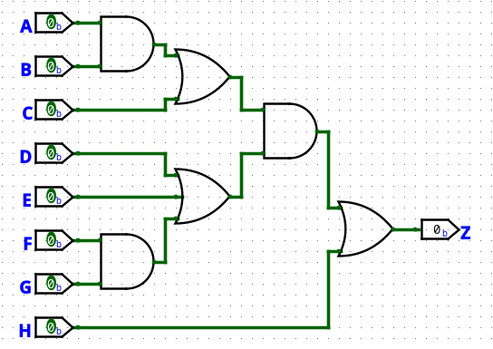

$(AB+C)(D+E+FG)+H$

- 4-level gate circuit, 4 gate delay

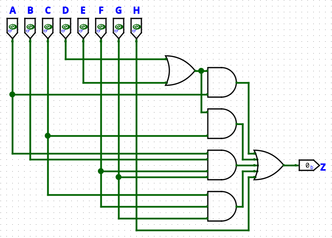

$A(D+E) + C(D+E) + ABFG + CFG + H$

- 3-level gate circuit, 3 gate delay

- input 개수가 많은 gate는 내부 구현에 따라 input 개수가 적은 gate보다 시간이 더 걸릴 수 있으므로 input 개수가 적은 gate를 쓰는 게 좋다.

### Example 2

- $F(a,b,c,d) = \sum m(1,5,6,10,13,14)$

<table>
	<thead>
		<tr>
			<th class='backslash'>
$ab$
$cd$</th>
			<th>00</th>
			<th>01</th>
			<th>11</th>
			<th>10</th>
		 </tr>
	</thead>
	<tbody>
		 <tr>
			<th>00</th>
			<td></td>
			<td></td>
			<td></td>
			<td></td>
		</tr>
		 <tr>
			<th>01</th>
			<td class="map2">1</td>
			<td class="map2_2">1</td>
			<td class="map2">1</td>
			<td></td>
		</tr>
		 <tr>
			<th>11</th>
			<td></td>
			<td></td>
			<td></td>
			<td></td>
		</tr>
		 <tr>
			<th>10</th>
			<td></td>
			<td class="map2">1</td>
			<td class="map2_2">1</td>
			<td class="map2">1</td>
		</tr>
	</tbody>
</table>

$$
\begin{align*}
F &= a^{\prime}c^{\prime}d + bc^{\prime}d + bcd^{\prime} + acd^{\prime} \\
  &= c^{\prime}d(a^{\prime}+b) + cd^{\prime}(b+a)
\end{align*}
$$

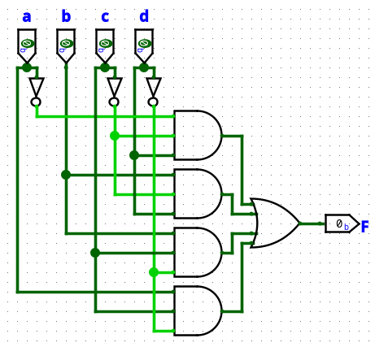

$a^{\prime}c^{\prime}d + bc^{\prime}d + bcd^{\prime} + acd^{\prime}$

- 2 levels, 5 gates, 16 gate inputs

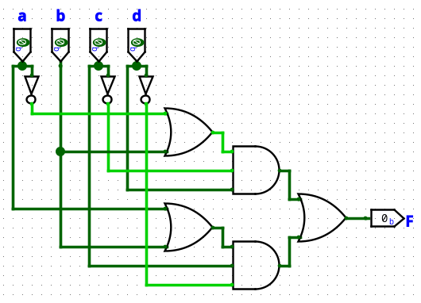

$c^{\prime}d(a^{\prime}+b) + cd^{\prime}(b+a)$

- 3 levels, 5 gates, 12 gate inputs

- $F(a,b,c,d) = \Pi M(0,2,3,4,7,8,9,11,12,15)$

<table>
	<thead>
		<tr>
			<th class='backslash'>
$ab$
$cd$</th>
			<th>00</th>
			<th>01</th>
			<th>11</th>
			<th>10</th>
		 </tr>
	</thead>
	<tbody>
		 <tr>
			<th>00</th>
			<td class="map3">0</td>
			<td class="map3">0</td>
			<td class="map3">0</td>
			<td class="map2_3">0</td>
		</tr>
		 <tr>
			<th>01</th>
			<td></td>
			<td></td>
			<td></td>
			<td class="map2">0</td>
		</tr>
		 <tr>
			<th>11</th>
			<td class="map2_3">0</td>
			<td class="map3">0</td>
			<td class="map3">0</td>
			<td class="map3">0</td>
		</tr>
		 <tr>
			<th>10</th>
			<td class="map2">0</td>
			<td></td>
			<td></td>
			<td></td>
		</tr>
	</tbody>
</table>

$$
\begin{align*}
F &= (c+d)(a^{\prime}+b+c)(c^{\prime}+d^{\prime})(a+b+c^{\prime}) \\
  &= (c + d(a^{\prime}+b))(c^{\prime}+d^{\prime}(a+b)) \\
  &= (c+a^{\prime}d+bd)(c^{\prime}+ad^{\prime}+bd^{\prime})
\end{align*}
$$

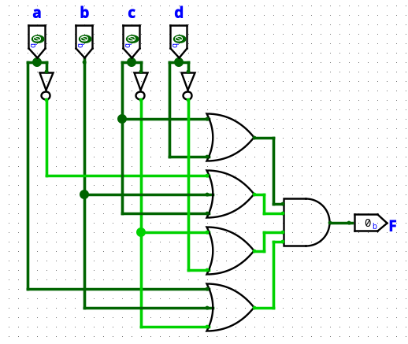

$(c+d)(a^{\prime}+b+c)(c^{\prime}+d^{\prime})(a+b+c^{\prime})$

- 2 levels, 5 gates, 14 gate inputs

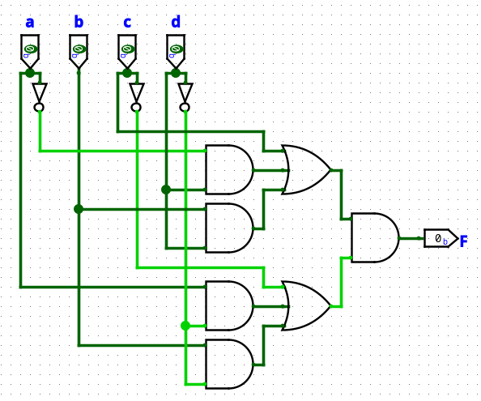

$(c+a^{\prime}d+bd)(c^{\prime}+ad^{\prime}+bd^{\prime})$

- 3 levels, 7 gates, 16 gate inputs

> 2 levels로 할 때는 $(c+d)(a^{\prime}+b+c)(c^{\prime}+d^{\prime})(a+b+c^{\prime})$가 더 좋고, 3 levels로 할 때는 $c^{\prime}d(a^{\prime}+b) + cd^{\prime}(b+a)$가 더 좋다.
>
> 동일한 함수라도 무슨 회로가 더 좋은지는 해봐야 안다.

## 7.2 NAND and NOR Gates

- NAND: AND 결과에 NOT

- NOR: OR 경과에 NOT

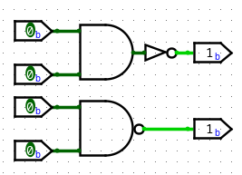

NAND

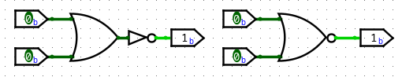

NOR

|$X$|$Y$|$(XY)^{\prime}$|$(X+Y)^{\prime}$|
|-|-|-|-|
|0|0|1|1|
|0|1|1|0|
|1|0|1|0|
|1|1|0|0|

### 사용하는 이유

- NAND와 NOR이 transistor가 더 적게 사용된다.

##### transistor

- AND, OR: transistor 6개

- NAND, NOR: transistor 4개

- NOT: transistor 2개

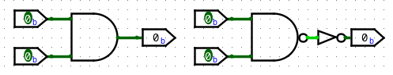

AND

- AND는 내부적으로 NAND와 NOT으로 구현된다.

### Functionally complete

- A set of logic operations is said to be **functionally complete** if any Boolean function can be expressed in terms of this set of operations

- The set AND,  OR, and NOT is obviously functionally complete because any function can be expressed in cum-of-products form, and a sum-of-products expression uses only the AND, OR, and Not operations

- Similarly, a set of logic gates is functionally complete if all switching functions can be realized using this set of gates.

- AND and NOT are a functionally complete set of gates because OR can also be realized using AND and NOT

	- $X+Y=(X^{\prime}Y^{\prime})^{\prime}$

	

	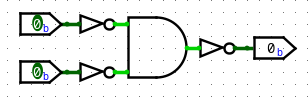

	OR realized using AND and NOT
	

- OR and NOT are a functionally complete set of gates because OR can also be realized using OR and NOT

	- $XY=(X^{\prime}+Y^{\prime})^{\prime}$

	

	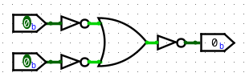

	AND realized using OR and NOT
	

- If a single gate forms a functionally complete set by itself, then any switching function can be realized using only gates of that type

	- AND, OR, NOT으로 표현한 뒤 functionally complete한 gate 하나로 변환한다.

##### NAND

- The NAND gate is functionally complete.

	- NOT

	

	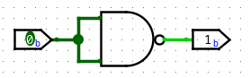

	NOT

	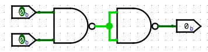

	AND

	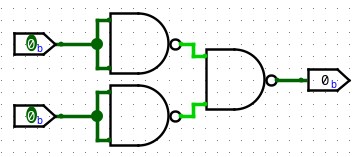

	OR
	

##### NOR

- The NOR gate is functionally complete.

	

	

	NOT

	

	AND

	

	OR
	

## 7.3 Design of Two-Level NAND- and NOR-Gate Circuits

- AND, OR, NOT으로 표현한 뒤 functionally complete한 gate 하나로 변환한다.

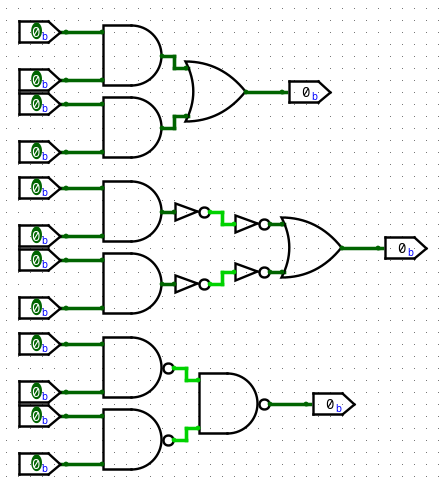

SOP $\rightarrow$ NAND-NAND

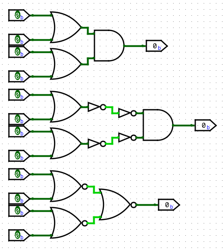

SOP $\rightarrow$ NOR-NOR

- 주어진 boolean expression을 여러 가지 형식으로 표현할 수 있다.

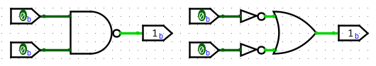

$(XY)^{\prime}=X^{\prime}+Y^{\prime}$

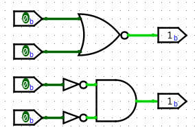

$(X+Y)^{\prime}=X^{\prime}Y^{\prime}$

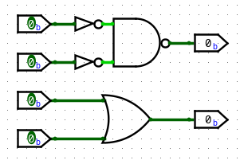

$(X^{\prime}Y^{\prime})^{\prime}=X+Y$

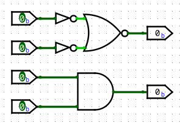

$(X^{\prime}+Y^{\prime})^{\prime}=XY$

### Example

$$
\begin{align*}
F &= A+BC^{\prime}+B^{\prime}CD = [(A+BC^{\prime}+B^{\prime}CD)^{\prime}]^{\prime} & \text{AND-OR}\\
  &= [A^{\prime}(BC^{\prime})^{\prime}(B^{\prime}CD)^{\prime}]^{\prime} & \text{NAND-NAND} \\
  &= [A^{\prime}(B^{\prime}+C)(B+C^{\prime}+D^{\prime})]^{\prime} & \text{OR-NAND} \\
  &= A + (B^{\prime}+C)^{\prime} + (B+C^{\prime}+D^{\prime})^{\prime} & \text{NOR-OR}
\end{align*}
$$

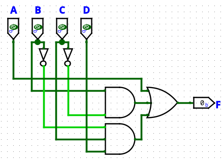

AND-OR

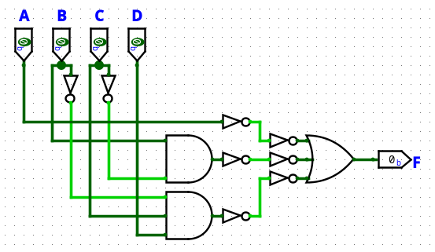

NAND-NAND

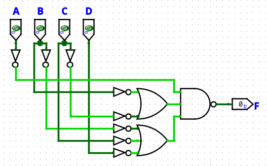
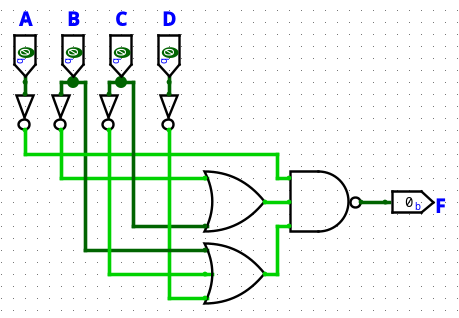

OR-NAND

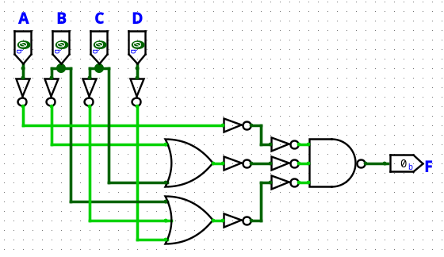

NOR-OR

## 7.4 Design of Multi-Level NAND- and NOR-Gate Circuits

### condition to design multi-level NAND-gate circuit

1. The output gate must be OR

2. AND-gate outputs cannot be used as AND-gate inputs

3. OR-gate outputs cannot be used as OR-gate inputs

### condition to design multi-level NOR-gate circuit

1. The output gate must be AND

2. AND-gate outputs cannot be used as AND-gate inputs

3. OR-gate outputs cannot be used as OR-gate inputs

### Example

- $F=a^{\prime}[b^{\prime}c(d+e^{\prime})+f^{\prime}g^{\prime}]+hi^{\prime}j+k$

## 7.6 Design of Two-Level, Multiple-Output Circuits

- 경험적으로 최대한 공통된 것을 공유하도록 한다.

### Example 1

- $F_1 = \sum m(11,12,13,14,15)$

- $F_2 = \sum m(3,7,11,12,13,15)$

- $F_3 = \sum m(3,7,12,13,14,15)$

<table>
	<caption>$F_1$</caption>
	<thead>
		<tr>
			<th class='backslash'>
$AB$
$CD$</th>
			<th>00</th>
			<th>01</th>
			<th>11</th>
			<th>10</th>
		 </tr>
	</thead>
	<tbody>
		 <tr>
			<th>00</th>
			<td></td>
			<td></td>
			<td class="map3">1</td>
			<td></td>
		</tr>
		 <tr>
			<th>01</th>
			<td></td>
			<td></td>
			<td class="map3">1</td>
			<td></td>
		</tr>
		 <tr>
			<th>11</th>
			<td></td>
			<td></td>
			<td class="map2_3">1</td>
			<td class="map2">1</td>
		</tr>
		 <tr>
			<th>10</th>
			<td></td>
			<td></td>
			<td class="map3">1</td>
			<td></td>
		</tr>
	</tbody>
</table>

- AND: 2, OR: 1

<table>
	<caption>$F_2$</caption>
	<thead>
		<tr>
			<th class='backslash'>
$AB$
$CD$</th>
			<th>00</th>
			<th>01</th>
			<th>11</th>
			<th>10</th>
		 </tr>
	</thead>
	<tbody>
		 <tr>
			<th>00</th>
			<td></td>
			<td></td>
			<td class="map2">1</td>
			<td></td>
		</tr>
		 <tr>
			<th>01</th>
			<td></td>
			<td></td>
			<td class="map2">1</td>
			<td></td>
		</tr>
		 <tr>
			<th>11</th>
			<td class="map3">1</td>
			<td class="map3">1</td>
			<td class="map3">1</td>
			<td class="map3">1</td>
		</tr>
		 <tr>
			<th>10</th>
			<td></td>
			<td></td>
			<td></td>
			<td></td>
		</tr>
	</tbody>
</table>

- AND: 2, OR: 1

<table>
	<caption>$F_2$</caption>
	<thead>
		<tr>
			<th class='backslash'>
$AB$
$CD$</th>
			<th>00</th>
			<th>01</th>
			<th>11</th>
			<th>10</th>
		 </tr>
	</thead>
	<tbody>
		 <tr>
			<th>00</th>
			<td></td>
			<td></td>
			<td class="map2">1</td>
			<td></td>
		</tr>
		 <tr>
			<th>01</th>
			<td></td>
			<td></td>
			<td class="map2">1</td>
			<td></td>
		</tr>
		 <tr>
			<th>11</th>
			<td class="map1">1</td>
			<td class="map1">1</td>
			<td class="map4">1</td>
			<td class="map4">1</td>
		</tr>
		 <tr>
			<th>10</th>
			<td></td>
			<td></td>
			<td></td>
			<td></td>
		</tr>
	</tbody>
</table>

- $CD$를 $A^{\prime}CD$, $ACD$로 나눠 각각에 $F_1$의 $ACD$, $F_3$의 $A^{\prime}CD$를 사용하면 AND: 1, OR: 1

<table>
	<caption>$F_3$</caption>
	<thead>
		<tr>
			<th class='backslash'>
$AB$
$CD$</th>
			<th>00</th>
			<th>01</th>
			<th>11</th>
			<th>10</th>
		</tr>
	</thead>
	<tbody>
		<tr>
			<th>00</th>
			<td></td>
			<td></td>
			<td class="map3">1</td>
			<td></td>
		</tr>
		<tr>
			<th>01</th>
			<td></td>
			<td></td>
			<td class="map3">1</td>
			<td></td>
		</tr>
		<tr>
			<th>11</th>
			<td class="map2">1</td>
			<td class="map2">1</td>
			<td class="map3">1</td>
			<td></td>
		</tr>
		<tr>
			<th>10</th>
			<td></td>
			<td></td>
			<td class="map3">1</td>
			<td></td>
		</tr>
	</tbody>
</table>

- AND: 2, OR: 1

- $F_1$의 $AB$를 사용하면 AND: 1, OR: 1

- 각자 간소화했을 때 AND: 6, OR: 3

- 공통된 부분 공유하도록 했을 때 AND: 4, OR: 3

### Example 2

<table>
	<caption>$f_1$</caption>
	<thead>
		<tr>
			<th class='backslash'>
$AB$
$CD$</th>
			<th>00</th>
			<th>01</th>
			<th>11</th>
			<th>10</th>
		 </tr>
	</thead>
	<tbody>
		 <tr>
			<th>00</th>
			<td></td>
			<td></td>
			<td></td>
			<td class="map3">1</td>
		</tr>
		 <tr>
			<th>01</th>
			<td></td>
			<td class="map3">1</td>
			<td class="map3">1</td>
			<td class="map3">1</td>
		</tr>
		 <tr>
			<th>11</th>
			<td class="map3">1</td>
			<td class="map3">1</td>
			<td class="map3">1</td>
			<td class="map3_3">1</td>
		</tr>
		 <tr>
			<th>10</th>
			<td class="map3">1</td>
			<td></td>
			<td></td>
			<td class="map3_3">1</td>
		</tr>
	</tbody>
</table>

<table>
	<caption>$f_1$</caption>
	<thead>
		<tr>
			<th class='backslash'>
$AB$
$CD$</th>
			<th>00</th>
			<th>01</th>
			<th>11</th>
			<th>10</th>
		 </tr>
	</thead>
	<tbody>
		 <tr>
			<th>00</th>
			<td></td>
			<td></td>
			<td></td>
			<td class="map2">1</td>
		</tr>
		 <tr>
			<th>01</th>
			<td></td>
			<td class="map1">1</td>
			<td class="map4">1</td>
			<td class="map2">1</td>
		</tr>
		 <tr>
			<th>11</th>
			<td class="map3">1</td>
			<td class="map1">1</td>
			<td class="map4">1</td>
			<td class="map3">1</td>
		</tr>
		 <tr>
			<th>10</th>
			<td class="map3">1</td>
			<td></td>
			<td></td>
			<td class="map3">1</td>
		</tr>
	</tbody>
</table>

- AND: 3, OR: 1

- $BD$를 $A^{\prime}BD$, $ABD$로 나눠 각각에 $F_2$의 $A^{\prime}BD$, $F_3$의 $ABD$를 사용하고, $AB^{\prime}$ 대신 $F_3$의 $AB^{\prime}C$를 사용하면 AND: 1, OR: 1

<table>
	<caption>$f_2$</caption>
	<thead>
		<tr>
			<th class='backslash'>
$AB$
$CD$</th>
			<th>00</th>
			<th>01</th>
			<th>11</th>
			<th>10</th>
		 </tr>
	</thead>
	<tbody>
		 <tr>
			<th>00</th>
			<td></td>
			<td></td>
			<td></td>
			<td></td>
		</tr>
		 <tr>
			<th>01</th>
			<td></td>
			<td class="map2">1</td>
			<td></td>
			<td></td>
		</tr>
		 <tr>
			<th>11</th>
			<td class="map4">1</td>
			<td class="map2_4">1</td>
			<td class="map4">1</td>
			<td class="map4">1</td>
		</tr>
		 <tr>
			<th>10</th>
			<td class="map4">1</td>
			<td class="map4">1</td>
			<td class="map4">1</td>
			<td class="map4">1</td>
		</tr>
	</tbody>
</table>

- AND: 1, OR: 1

<table>
	<caption>$f_3$</caption>
	<thead>
		<tr>
			<th class='backslash'>
$AB$
$CD$</th>
			<th>00</th>
			<th>01</th>
			<th>11</th>
			<th>10</th>
		 </tr>
	</thead>
	<tbody>
		 <tr>
			<th>00</th>
			<td></td>
			<td></td>
			<td></td>
			<td class="map2">1</td>
		</tr>
		 <tr>
			<th>01</th>
			<td></td>
			<td></td>
			<td class="map2">1</td>
			<td class="map2">1</td>
		</tr>
		 <tr>
			<th>11</th>
			<td></td>
			<td class="map3">1</td>
			<td class="map2_3">1</td>
			<td></td>
		</tr>
		 <tr>
			<th>10</th>
			<td></td>
			<td class="map3">1</td>
			<td class="map3">1</td>
			<td></td>
		</tr>
	</tbody>
</table>

- AND: 3, OR:1

- 각자 간소화했을 때 AND: 7, OR: 3

- 공통된 부분 공유하도록 했을 때 AND: 5, OR: 3
