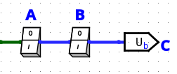

# Ch2 Boolean Algebra
{: .no_toc }

<details markdown="block">
  <summary>
	Table of contents
  </summary>
{: .fs-3 .text-delta }

- TOC
{:toc}
</details>

---

## 2.1 Introduction

- 0과 1의 두 가지 symbol을 갖는 경우에 대한 연산을 다룬다.

- boolean variable: 0 또는 1의 값을 가지는 변수

---

## 2.2 Basic Operations

### Switch

- switch를 도입해서 이해

$$
\begin{cases}
x = 0 & \text{if open} \\
x = 1 & \text{if closed}
\end{cases}
$$

### complement

- 단항 연산자

- the complement of 0 = 1, the complement of 1 = 0

- $0^{\prime} = 1$, $1^{\prime} = 0$

- $\bar{0} = 1$, $\bar{1} = 0$

$$
\begin{cases}
x^{\prime} = 1 & \text{if }x = 0 \\
x^{\prime} = 0 & \text{if }x = 1
\end{cases}
$$


<center markdown="block">


inversion, negative gate
</center>

### And

<center markdown="block">

</center>

$$
C =
\begin{cases}
0 & \text{open} & \text{if either A or B is open} \\
1 & \text{closed} & \text{if both A and B are closed}
\end{cases}
$$

- 이항 연산자

- $A \cdot B$

- $A \land B$

- $AB$

|$A$|$B$|$A \cdot B$|
|-|-|-|
|0|0|0|
|0|1|0|
|1|0|0|
|1|1|1|

<center markdown="block">


and gate
</center>

### Or

<center markdown="block">

</center>

- 이항 연산자

- $A + B$

- $A \lor B$

|$A$|$B$|$A \cdot B$|
|-|-|-|
|0|0|0|
|0|1|1|
|1|0|1|
|1|1|1|

<center markdown="block">


or gate
</center>

---

## 2.3 Boolean Expressions and Truth Tables

### Boolean expression

- boolean constant, boolean variable, boolean operator의 조합

- ex) $AB^{\prime} + C$, $[A(C+D)]^{\prime} + BE$

<center markdown="block">


$AB^{\prime} + C$, $[A(C+D)]^{\prime} + BE$
</center>

- expression is evaluated by substituting a value of 0 or 1 for each variable

	- ex) $A=B=C=1$, $D=E=0$, $[A(C+D)]^{\prime}+BE=[1(1+0)]^{\prime} + 1\cdot0 = 0$

- literal: variable or its complement

	- ex) $ab^{\prime}c + a^{\prime}b + a^{\prime}bc^{\prime} + b^{\prime}c$에서 variable은 3개, literal은 10개

	- literal의 개수는 input의 라인 수

		<center markdown="block">
		

		$ab^{\prime}c + a^{\prime}b + a^{\prime}bc^{\prime} + b^{\prime}c$
		</center>

### Truth Table

- 변수에 대해 가능한 모든 경우를 표로 나타내는 것

	- ex) $AB^{\prime}+C$

		|$A$|$B$|$C$|$AB^{\prime}+C$|
		|-|-|-|-|
		|0|0|0|0|
		|0|0|1|1|
		|0|1|0|0|
		|0|1|1|1|
		|1|0|0|1|
		|1|0|1|1|
		|1|1|0|0|
		|1|1|1|1|

---

## 2.4 Basic Theorems

### Operations with 0 and 1

- $X+0=X$

- $X\cdot1=X$

- $X+1=1$

- $X\cdot0=0$

```c
#include <stdio.h>

int main() {
	int x, y;

	x = -2;
	y = 2;

	if (x>0 && y++<0);
	printf("x: %d, y: %d\n", x, y);

	if (x<0 || y++<0);
	printf("x: %d, y: %d", x, y);

	return 0;
}
```

```
x: 2, y: 3
x: -2, y: 3
```

### Idempotent laws

- $X+X=X$

- $X \cdot X = X$

### Involution law

- $(X^{\prime})^{\prime} = X$

### Laws of complementarity

- $X+X^{\prime}=1$

- $X \cdot X^{\prime} = 0$

---

## 2.5 Commutative, Associative, Distributive, and DeMorgan's Laws

### Commutative laws(교환 법칙)

- $X \cdot Y = Y \cdot X$

- $X + Y = Y + X$

### Associative laws(결합 법칙)

- $(XY)Z = X(YZ) = XYZ$

- $(X+Y)+Z = X+(Y+Z) = X + Y + Z$

<center markdown="block">


$(XY)Z$


$XYZ$

</center>

##### Proof

- $(XY)Z = X(YZ) = XYZ$

	|$X$|$Y$|$Z$|$(XY)Z$|$X(YZ)$|
	|-|-|-|-|-|
	|0|0|0|0|0|
	|0|0|1|0|0|
	|0|1|0|0|0|
	|0|1|1|0|0|
	|1|0|0|0|0|
	|1|0|1|0|0|
	|1|1|0|0|0|
	|1|1|1|1|1|

---

- $XYZ = 1 \text{ iff } X=Y=Z=1$

- $X+Y+Z=0 \text{ iff } X=Y=Z=0$

---

### Distributive laws(분배 법칙)

- $X(Y+Z) = XY + XZ$

- $X+YZ=(X+Y)(X+Z)$

##### Proof

- $X(Y+Z) = XY + XZ$

	|$X$|$Y$|$Z$|$X(Y+Z)$|$XY+XZ$|
	|-|-|-|-|-|
	|0|0|0|0|0|
	|0|0|1|0|0|
	|0|1|0|0|0|
	|0|1|1|0|0|
	|1|0|0|0|0|
	|1|0|1|1|1|
	|1|1|0|1|1|
	|1|1|1|1|1|

- $X+YZ=(X+Y)(X+Z)$

	- truth table

		|$X$|$Y$|$Z$|$X+YZ$|$(X+Y)(X+Z)$|
		|-|-|-|-|-|
		|0|0|0|0|0|
		|0|0|1|0|0|
		|0|1|0|0|0|
		|0|1|1|1|1|
		|1|0|0|1|1|
		|1|0|1|1|1|
		|1|1|0|1|1|
		|1|1|1|1|1|

	- expression

		- 앞의 distributive law를 사용하여 증명

		$$
		\begin{align*}
		(X+Y)(X+Z) &= X(X+Z) + Y(X+Z) \\
				   &= X + XZ + XY + YZ \\
				   &= X(1+Z+y) + YZ \\
				   &= X + YZ
		\end{align*}
		$$

### DeMorgan's laws

- $(X+Y)^{\prime} = X^{\prime}Y^{\prime}$

- $(XY)^{\prime} = X^{\prime} + Y^{\prime}$

##### Proof

- $(X+Y)^{\prime} = X^{\prime}Y^{\prime}$

	|$X$|$X$|$(X+B)^{\prime}$|$X^{\prime}Y^{\prime}$|
	|-|-|-|-|
	|0|0|1|1|
	|0|1|0|0|
	|1|0|0|0|
	|1|1|0|0|

### Duality

- Given a Boolean algebra expression, the dual of the expression is obtained by interchanging the constants 0 and 1, and interchanging the operations AND and OR. Variables and complements are left unchanged.

- ex)

	- $(A+B^{\prime})^D = AB^{\prime}$

	- $(A^{\prime}B + C + 0)^D = (A^{\prime}+B) \cdot C \cdot 1$

		<center markdown="block">
		

		$A^{\prime}B + C + 0$

		

		$(A^{\prime}+B) \cdot C \cdot 1$
		</center>

---

## 2.6 Simplification Theorems

- 말로 이해하면 쉬움

### Uniting

- $XY+XY^{\prime} = X$

- $(X+Y)(X+Y^{\prime}) = X$

##### Proof

- $XY+XY^{\prime} = X(Y+Y^{\prime}) = X \cdot 1 = X$

- $(X+Y)(X+Y^{\prime}) = X + YY^{\prime} = X$

### Absorption

- $X + XY = X$

- $X(X+Y) = X$

##### Proof

- $X + XY = X(1+Y) = X$

- $X(X+Y) = X + XY = X(1+Y) = X$

### Elimination

- $X+X^{\prime}Y=X+Y$

- $X(X^{\prime} + Y) = XY$

##### Proof

- $X+X^{\prime}Y=(X+X^{\prime})(X+Y) = X+Y$

### Consensus

- $XY + X^{\prime}Z + YZ = XY + X^{\prime}Z$

	- $+YZ$는 redundant(불필요)

- $(X+Y)(X^{\prime}+Z)(Y+Z) = (X+Y)(X^{\prime}+Z)$

	- $\cdot(Y+Z)$는 redundant

### Example

- $Z=A^{\prime}BC + A^{\prime} = A^{\prime}$

- $Z = [A+B^{\prime}C + D + EF)(A + B^{\prime}C + (D+EF)^{\prime}] = A + B^{\prime}C$

---

## 2.7 Multiplying Out and Factoring

- Factoring: 인수분해

### Sum of product form

- When all products are the products of single variables

- ex)

	- $AB^{\prime}C + CD^{\prime}C + CD^{\prime}E + AC^{\prime}E^{\prime}$

	- $(A+B)CD + EF$ is not SOP form

	- $ACD + BCD + EF$ is SOP form

- 만드는 방법: distributive laws-1 사용

### Product of sum form

- When all sums are the sums of single variables

- ex)

	- $(A+B)(C+D^{\prime}+E)(A+C^{\prime}+E^{\prime})$

	- $(A+B)(C+DE)$ is not POS

- 만드는 방법: distributive law-2 사용

### Example

- $A+B^{\prime}CD = (A+B^{\prime})(A+C)(A+D)$

- $AB^{\prime} + C^{\prime}D = (AB^{\prime} + C^{\prime})(AB^{\prime} + D) = (A + C^{\prime})(B^{\prime} + C^{\prime})(A + D)(B^{\prime} + D)$

	<center markdown="block">
	

	sum of product

	

	product of sum
	</center>

---

## 2.8 Complementing Boolean Expressions

- $(x_1 + x_2 + \cdots + x_n)^{\prime} = x_1^{\prime}x_2^{\prime} \cdots x_n^{\prime}$

- $(x_1x_2 \cdots x_n)^{\prime} = x_1^{\prime} + x_2^{\prime} + \cdots + x_n^{\prime}$

### Example

- $[(A^{\prime}+B)C^{\prime}]^{\prime} = AB^{\prime} + C$

- $(AB^{\prime} + C)^{\prime} = (A^{\prime}+B)C^{\prime}$

	- cf) $(AB^{\prime} + C)^D = (A+B^{\prime})C$

---

## HW2

### 2.7

- draw circuit

- use one AND gate and one OR gate

##### a

- $(A+B+C+D)(A+B+C+E)(A+B+C+F) = A + B + C + DEF$

<center markdown="block">


$A + B + C + DEF$
</center>

##### b

- $WXYZ + VXYZ + UXYZ = XYZ(U+V+W)$

<center markdown="block">


$XYZ(U+V+W)$
</center>

### 2.9

- Simplify

<center markdown="block">

</center>

##### a

$$
\begin{align*}
F &= (((A+B)^{\prime}+A)^{\prime} + (A+B)^{\prime}) ((A+B)^{\prime}+A)^{\prime} \\
  &= ((A+B)^{\prime} + A)^{\prime} \\
  &= (A+B)A^{\prime} \\
  &= A^{\prime}+B
\end{align*}
$$

<center markdown="block">


$A^{\prime}+B$
</center>

##### b

$$
\begin{align*}
G &= (((R+S+T)^{\prime}P((R+S)^{\prime}T))^{\prime}T)^{\prime} \\
  &= ((R^{\prime}S^{\prime}T^{\prime}P(R+S)^{\prime}T)^{\prime}T)^{\prime} \\
  &= (0^{\prime}T)^{\prime} \\
  &= T^{\prime}
\end{align*}
$$

<center markdown="block">


$T^{\prime}$
</center>

### 2.22

- Factor

- obtain a product of sum

##### a

$$
\begin{align*}
A^{\prime}B^{\prime} + A^{\prime}CD + A^{\prime}DE^{\prime} &= A^{\prime}B^{\prime} + A^{\prime}D(C + E^{\prime}) \\
 &= A^{\prime}(B^{\prime} + D(C+E^{\prime})) \\
 &= A^{\prime}(B^{\prime}+D)(B^{\prime} +C + E^{\prime})
\end{align*}
$$

##### c

$$
\begin{align*}
A^{\prime}BC + A^{\prime}B^{\prime}C + CD^{\prime} &= A^{\prime}C + CD^{\prime} \\
  &= C(A^{\prime} + D^{\prime})
\end{align*}
$$

##### e

$$
\begin{align*}
A^{\prime}B^{\prime}C + B^{\prime}CD^{\prime} + EF^{\prime} &= B^{\prime}C(A^{\prime} + D^{\prime}) + EF^{\prime} \\
  &= (B^{\prime}C + EF^{\prime})(A^{\prime} + D^{\prime} + EF^{\prime}) \\
  &= (B^{\prime} + EF^{\prime})(C + EF^{\prime})(A^{\prime} + D^{\prime} + E)(A^{\prime} + D^{\prime} + F^{\prime}) \\
  &= (B^{\prime} + E)(B^{\prime} + F^{\prime})(C + E)(C + F^{\prime})(A^{\prime} + D^{\prime} + E)(A^{\prime} + D^{\prime} + F^{\prime})
\end{align*}
$$

### 2.27

- Draw a circuit

- use two OR gates and two AND gates

##### Answer

$$
\begin{align*}
F &= (V+W+X)(V+X+Y)(V+Z) \\
  &= (V+X+WY)(V+Z)
\end{align*}
$$

<center markdown="block">
  
</center>
