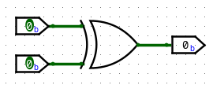
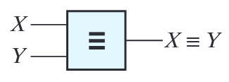

# Ch3 Boolean Algebra (Continued)
{: .no_toc }

  

	Table of contents
  

{: .fs-3 .text-delta }

- TOC
{:toc}

---

## 3.1 Multiplying Out and Factoring Expressions

- $(X+Y)(X^{\prime}+Z) = X^{\prime}Y + XZ$

	- $(X+Y)(X^{\prime}+Z) = XX^{\prime} + XZ + X^{\prime}Y + YZ = XZ + X^{\prime}Y$

	- $X=0;\,Y$, $X=1;\,Z$

### Example

- $(Q+AB^{\prime})(C^{\prime}D+Q^{\prime}) = QC^{\prime}D + Q^{\prime}AB^{\prime}$

## 3.2 Exclusive-OR and Equivalence Operations

### Exclusive-OR(XOR)

|$A$|$B$|$A\oplus B$|
|-|-|-|
|0|0|0|
|0|1|1|
|1|0|1|
|1|1|1|

- $X\oplus Y = X^{\prime}Y + XY^{\prime}$

- 1의 개수가 짝수일 때 0, 홀수 일 때 1

	- logisim에서 xor 게이트는 input이 3개 이상일 때 1의 개수가 1개일 경우에만 1이 나온다. 따라서 input이 3개 이상일 때는 2 input xor을 연결하여 구현한다.

- parity bit에 사용된다.

  

  xor gate

##### Theorems

- $X\oplus0=X$

- $X\oplus1=X^{\prime}$

- $X\oplus X = 0$

- $X\oplus X^{\prime} =1$

- $X \oplus Y = Y \oplus X$ (commutative law)

- $(X \oplus Y) \oplus Z = X \oplus (Y \oplus Z) = X \oplus Y \oplus Z$ (associative law)

##### Proof

$$
\begin{align*}
(X \oplus Y) \oplus Z &= (X^{\prime}Y + XY^{\prime}) \oplus Z \\
  &= (X^{\prime}Y + XY^{\prime})^{\prime}Z + (X^{\prime}Y + XY^{\prime})Z^{\prime} \\
  &= (X^{\prime}Y^{\prime} + XY)Z + (X^{\prime}Y + XY^{\prime})Z^{\prime} \\
  &= X^{\prime}Y{\prime}Z + XYZ + X^{\prime}YZ^{\prime} + XY^{\prime}Z^{\prime}
\end{align*}
$$

|$X$|$Y$|$Z$|$(X \oplus Y) \oplus Z$|$X \oplus (Y \oplus Z)$|
|-|-|-|-|-|
|0|0|0|0|0|
|0|0|1|1|1|
|0|1|0|1|1|
|0|1|1|0|0|
|1|0|0|1|1|
|1|0|1|0|0|
|1|1|0|0|0|
|1|1|1|1|1|

### Equivalence

|$A$|$B$|$A \equiv B$|
|-|-|-|
|0|0|1|
|0|1|0|
|1|0|0|
|1|1|1|

- $X \equiv Y = (X \oplus Y)^{\prime}$

- 1의 개수가 짝수이면 1, 홀수이면 0

	- logisim에서 xnor 게이트는 input이 3개 이상일 때 1의 개수가 1개일 경우에만 0이 나온다. 따라서 input이 3개 이상일 때는 2 input xnor을 연결하여 구현한다.

  

  equivalence gate

  

  xnor gate

## 3.3 The Consensus Theorem

### Example

$$
\begin{align*}
F &= ABCD + B^{\prime}CDE + A^{\prime}B^{\prime} + BCE^{\prime} \\
  &= ABCD + B^{\prime}CDE + ACDE + A^{\prime}B^{\prime} + BCE^{\prime} \\
  &= ACDE + A^{\prime}B^{\prime} + BCE^{\prime}
\end{align*}
$$
