# Ch4 Applications of Boolean Algebra Minterm and Maxterm Expansions
{: .no_toc }

  

	Table of contents
  

{: .fs-3 .text-delta }

- TOC
{:toc}

---

## 4.1 Conversion of English Sentences to Boolean Equations

### Steps

1. Find a switching function that specifies the desired behavior of the circuit

2. Find a simplified algebraic expression for the function

3. Realize the simplified function using available logic elements

### Example

> Mary watches TV if it is Monday night and she has finished her homework

- $F = 1$ if "Mary watches TV" is true; otherwise $F=0$

- $A = 1$ if "it is Monday night" is true; otherwise, $A=0$

- $B=1$ if "she has finished her homework" is true; otherwise $B=0$

- $F=A\cdot B$

## 4.2 Combinational Logic Design Using a Truth Table

### 두가지 논리 회로

- combinational logic: input의 combination에 의해서 함수의 결과값이 결정되는 logic

- sequential logic: input과 현재 상태에 의해서 함수의 결과값이 결정되는 logic

	- 상태를 기억하기 위해 memory 기능이 있음

### 표현 방법

1. boolean expression

2. truth table

### Example

- $A$, $B$, $C$ represent the first, second, third bits of  a binary number $N$

$$
f =
\begin{cases}
1 & \text{if } N \ge 011_2 \\
0 & \text{if } N < 011_2
\end{cases}
$$

##### Truth table

|$A$|$B$|$C$|$f$|
|-|-|-|-|
|0|0|0|0|
|0|0|1|0|
|0|1|0|0|
|0|1|1|1|
|1|0|0|1|
|1|0|1|1|
|1|1|0|1|
|1|1|1|1|

##### Bolean expression

- minterm expansion

|$A$|$B$|$C$|$f$|$A^{\prime}BC$|$AB^{\prime}C^{\prime}$|
|-|-|-|-|-|-|
|0|0|0|0|0|0|
|0|0|1|0|0|0|
|0|1|0|0|0|0|
|0|1|1|1|1|0|
|1|0|0|1|0|1|
|1|0|1|1|0|0|
|1|1|0|1|0|0|
|1|1|1|1|0|0|

$$
\begin{align*}
f &= A^{\prime}BC + AB^{\prime}C^{\prime} + AB^{\prime}C + ABC^{\prime} + ABC \\
  &= BC + AB^{\prime} + AB \\
  &= A + BC
\end{align*}
$$

- maxterm expansion

|$A$|$B$|$C$|$f$|$A^{\prime}BC$|$AB^{\prime}C^{\prime}$|$A+B+C$|$A+B+C^{\prime}$|$A+B^{\prime}+C$|
|-|-|-|-|-|-|-|
|0|0|0|0|0|0|0|1|1|
|0|0|1|0|0|0|1|0|1|
|0|1|0|0|0|0|1|1|0|
|0|1|1|1|1|0|1|1|1|
|1|0|0|1|0|1|1|1|1|
|1|0|1|1|0|0|1|1|1|
|1|1|0|1|0|0|1|1|1|
|1|1|1|1|0|0|1|1|1|

- $f = (A+B+C)(A+B+C^{\prime})(A+B^{\prime}+C)$

|$A$|$B$|$C$|$f$|$f^{\prime}$
|-|-|-|-|-|
|0|0|0|0|1|
|0|0|1|0|1|
|0|1|0|0|1|
|0|1|1|1|0|
|1|0|0|1|0|
|1|0|1|1|0|
|1|1|0|1|0|
|1|1|1|1|0|

- $f^{\prime} = A^{\prime}B^{\prime}C^{\prime} + A^{\prime}BC^{\prime} + A^{\prime}BC^{\prime}$

$$
\begin{align*}
f &= (f^{\prime})^{\prime} \\
  &= (A^{\prime}B^{\prime}C^{\prime} + A^{\prime}BC^{\prime} + A^{\prime}BC^{\prime})^{\prime} \\
  &= (A+B+C)(A+B^{\prime}+C)(A+B^{\prime}+C)
\end{align*}
$$

## 4.3 Minterm and Maxterm Expansions

### Minterm

- Minterm of $n$ variables: a product of $n$ literals in which each variable appears exactly once

	- $n=3$

	| |$A$|$B$|$C$|Minterm|
	|-|-|-|-|-|
	|0|0|0|0|$A^{\prime}B^{\prime}C^{\prime}=m_0$|
	|1|0|0|1|$A^{\prime}B^{\prime}C=m_1$|
	|2|0|1|0|$A^{\prime}BC^{\prime}=m_2$|
	|3|0|1|1|$A^{\prime}BC=m_3$|
	|4|1|0|0|$AB^{\prime}C^{\prime}=m_4$|
	|5|1|0|1|$AB^{\prime}C=m_5$|
	|6|1|1|0|$ABC^{\prime}=m_6$|
	|7|1|1|1|$ABC=m_7$|

- When a function is written as a sum of minterms, minterm expansion

	- $n=3$

	$$
	\begin{align*}
	f &= A^{\prime}BC + AB^{\prime}C^{\prime} + AB^{\prime}C + ABC^{\prime} + ABC \\
	  &= m_3 + m_4 + m_5 + m_6 + m_7 \\
	  &= \sum m(3,4,5,6,7)
	\end{align*}
	$$

### Maxterm

- Maxterm of $n$ variables: a sum of $n$ literals in which each variable appears exactly once

	- $n=3$

	| |$A$|$B$|$C$|Maxterm|
	|-|-|-|-|-|
	|0|0|0|0|$A+B+C=M_0$|
	|1|0|0|1|$A+B+C^{\prime}=M_1$|
	|2|0|1|0|$A+B^{\prime}+C=M_2$|
	|3|0|1|1|$A+B^{\prime}+C^{\prime}=M_3$|
	|4|1|0|0|$A^{\prime}+B+C=M_4$|
	|5|1|0|1|$A^{\prime}+B+C^{\prime}=M_5$|
	|6|1|1|0|$A^{\prime}+B^{\prime}+C=M_6$|
	|7|1|1|1|$A^{\prime}+B^{\prime}+C^{\prime}=M_7$|

- When a function is written as a product of maxterm, maxterm expansion

	- $n=3$

	$$
	\begin{align*}
	f &= (A+B+C)(A+B+C^{\prime})(A+B^{\prime}+C) \\
	  &= M_0M_1M_2 \\
	  &= \Pi M(0, 1, 2)
	\end{align*}
	$$

### Relation

| |$A$|$B$|$C$|Minterm|Maxterm|
|-|-|-|-|-|
|0|0|0|0|$A^{\prime}B^{\prime}C^{\prime}=m_0$|$A+B+C=M_0$|
|1|0|0|1|$A^{\prime}B^{\prime}C=m_1$|$A+B+C^{\prime}=M_1$|
|2|0|1|0|$A^{\prime}BC^{\prime}=m_2$|$A+B^{\prime}+C=M_2$|
|3|0|1|1|$A^{\prime}BC=m_3$|$A+B^{\prime}+C^{\prime}=M_3$|
|4|1|0|0|$AB^{\prime}C^{\prime}=m_4$|$A^{\prime}+B+C=M_4$|
|5|1|0|1|$AB^{\prime}C=m_5$|$A^{\prime}+B+C^{\prime}=M_5$|
|6|1|1|0|$ABC^{\prime}=m_6$|$A^{\prime}+B^{\prime}+C=M_6$|
|7|1|1|1|$ABC=m_7$|$A^{\prime}+B^{\prime}+C^{\prime}=M_7$|

- $(m_i)^{\prime} = M_i$

- minterm expansion: $f = \sum m(3,4,5,6,7)$

- maxterm expansion: $f = \Pi M(0,1,2)$

$$
\begin{align*}
f^{\prime} &= (\sum m(3,4,5,6,7))^{\prime} \\
           &= \Pi m^{\prime}(3,4,5,6,7) \\
		   &= \Pi M(3,4,5,6,7)
\end{align*}
$$

$$
\begin{align*}
f &= (f^{\prime})^{\prime} \\
  &= (\Pi M(3,4,5,6,7))^{\prime} \\
  &= \Pi M(0,1,2)
\end{align*}
$$

### Example

- $f(a,b,c,d) = a^{\prime}(b^{\prime} + d) + acd^{\prime}$의 minterm expansion, maxterm expansion

	- minterm expansion

		$$
		\begin{align*}
		f(a,b,c,d) &= a^{\prime}(b^{\prime} + d) + acd^{\prime} \\
				   &= a^{\prime}b^{\prime} + a^{\prime}d + acd^{\prime} \\
				   &= a^{\prime}b^{\prime}c^{\prime}d^{\prime} + a^{\prime}b^{\prime}c^{\prime}d + a^{\prime}b^{\prime}cd^{\prime} + a^{\prime}b^{\prime}cd + a^{\prime}bc^{\prime}d + a^{\prime}bcd + ab^{\prime}cd^{\prime} + abcd^{\prime} \\
				   &= \sum m(0, 1, 2, 3, 5, 7, 10, 14)
		\end{align*}
		$$

	- maxterm expansion

		- $f(a,b,c,d) = \Pi M(4, 6,8,9,11,12,13,15)$

## 4.4 General Minterm and Maxterm Expansions

### Generalization

|$A$|$B$|$C$|$F$|
|-|-|-|-|
|0|0|0|$a_0$|
|0|0|1|$a_1$|
|0|1|0|$a_2$|
|0|1|1|$a_3$|
|1|0|0|$a_4$|
|1|0|1|$a_5$|
|1|1|0|$a_6$|
|1|1|1|$a_7$|

$$
\begin{align*}
F &= \sum_{i=0}^7 a_im_i \\
  &= \Pi_{i=0}^7 (a_i+M_i)
\end{align*}
$$

$$
\begin{align*}
F^{\prime} &= (\Pi_{i=0}^7(a_i+M_i))^{\prime} \\
		   &= \sum_{i=0}a^{\prime}_im_i \\
		   &= \Pi_{i=0}^7(a^{\prime}_i+M_i)
\end{align*}
$$

### Product

- $f_1 = \sum a_im_i$, $f_2 = \sum b_jm_j$

- if $i \ne j$, $m_im_j=0$

$$
\begin{align*}
f_1f_2 &= (\sum a_im_i)(\sum b_jm_j) \\
       &= \sum a_ib_im_i
\end{align*}
$$

##### Example

- $f_1 = \sum m(0,2,3,5,9,11)$, $f_2=\sum m(0,3,9,11,13,14)$

	- $f_1f_2 = \sum m(0,3,9,11)$

	- $f_1+f_2 = \sum m(0,2,3,5,9,11,13,14)$

## 4.5 Incompletely Specified Functions

- $A=f_1(w,x,y,z)$, $B=f_2(w,x,y,z)$, $C=f_3(w,x,y,z)$

- $F=f_2(A,B,C)$

|$w$|$x$|$y$|$z$|$A$|$B$|$C$|
|-|-|-|-|-|-|-|
|0|0|0|0|0|1|0|
|0|0|0|1|1|0|0|
|$\vdots$|$\vdots$|$\vdots$|$\vdots$|$\vdots$|$\vdots$|$\vdots$|
|1|1|1|1|1|1|1|

- $N_1$의 결과값이 $A$, $B$, $C$의 모든 조합을 만들지 않을 수 있다.

- $A$, $B$, $C$가 001과 110이 되도록하는 $w$, $x$, $y$, $z$이 존재하지 않을 경우, $N_2$을 설계할 때 $ABC=001 \text{ or } 110$에 대한 $F$의 값은 고려하지 않아도 된다.

|$A$|$B$|$C$|$F$|
|-|-|-|-|
|0|0|0|1|
|0|0|1|X|
|0|1|0|0|
|0|1|1|1|
|1|0|0|0|
|1|0|1|0|
|1|1|0|X|
|1|1|1|1|

- X는 값이 0이거나 1이거나 상관없다는 것을 나타내고 don't care term이라고 하고, $F$는 $incompletely\; specified$라고 한다.

$$
\begin{align*}
F &= \sum m(0,3,7) + \sum d(1,6) \\
  &= \Pi M(2,4,5)\Pi D(1,6)
\end{align*}
$$

$$
\begin{align*}
F &= A^{\prime}B^{\prime}C^{\prime} + A^{\prime}BC + ABC \\
  &= A^{\prime}B^{\prime}C^{\prime} + BC \\
  &= A^{\prime}B^{\prime}C^{\prime} + A^{\prime}B^{\prime}C + BC \\
  &= A^{\prime}B^{\prime} + BC
\end{align*}
$$

## 4.6 Examples of Truth Table Construction

### Example 1. 1-bit half adder

$$
\begin{matrix}
\quad 0 \\
\underline{+\; 0} \\
\;\;\, 00
\end{matrix}
$$
$$
\begin{matrix}
\quad\quad 0 \\
\quad\underline{+\; 1} \\
\quad\;\;\, 01
\end{matrix}
$$
$$
\begin{matrix}
\quad\quad 1 \\
\quad\underline{+\; 0} \\
\quad\;\;\, 01
\end{matrix}
$$
$$
\begin{matrix}
\quad\quad 1 \\
\quad\underline{+\; 1} \\
\quad\;\;\, 11
\end{matrix}
$$

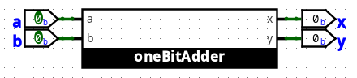

|$a$|$b$|$x$|$y$|
|-|-|-|-|
|0|0|0|0|
|0|1|0|1|
|1|0|0|1|
|1|1|1|0|

- $x = ab$

- $y = a^{\prime}b + ab^{\prime} = a \oplus b$

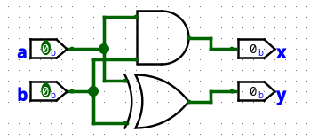

### Example 2. 2-bit adder

$$
\begin{matrix}
\quad 01 \\
\underline{+\; 10} \\
\;\;\, 011
\end{matrix}
$$
$$
\begin{matrix}
\quad\quad 11 \\
\quad\underline{+\; 01} \\
\quad\;\;\, 100
\end{matrix}
$$

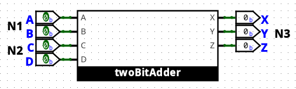

|$A$|$B$|$C$|$D$|$X$|$Y$|$Z$|
|-|-|-|-|-|-|-|
|0|0|0|0|0|0|0|
|0|0|0|1|0|0|1|
|0|0|1|0|0|1|0|
|0|0|1|1|0|1|1|
|0|1|0|0|0|0|1|
|0|1|0|1|0|1|0|
|0|1|1|0|0|1|1|
|0|1|1|1|1|0|0|
|1|0|0|0|0|1|0|
|1|0|0|1|0|1|1|
|1|0|1|0|1|0|0|
|1|0|1|1|1|0|1|
|1|1|0|0|0|1|1|
|1|1|0|1|1|0|0|
|1|1|1|0|1|0|1|
|1|1|1|1|1|1|0|

- $X = A^{\prime}BCD + AB^{\prime}CD^{\prime} + AB^{\prime}CD + ABC^{\prime}D + ABCD^{\prime} + ABCD$

- $Y = \cdots$, $Z = \cdots$

## 4.7 Design of Binary Adders and Subtracters

### 4-bit Adder

$$
\begin{matrix}
\quad\quad 0010 \\
\quad\underline{+\; 0111} \\
\quad\;\;\, 01001
\end{matrix}
$$

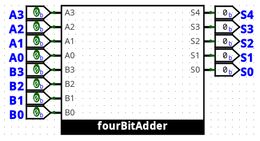

|$A_3$|$A_2$|$A_1$|$A_0$|$B_3$|$B_2$|$B_1$|$B_0$|$S_4$|$S_3$|$S_2$|$S_1$|$S_0$|
|-|-|-|-|-|-|-|-|-|-|-|-|-|
|0|0|0|0|0|0|0|0|0|0|0|0|0|
|0|0|0|0|0|0|0|1|0|0|0|0|1|
|$\vdots$|$\vdots$|$\vdots$|$\vdots$|$\vdots$|$\vdots$|$\vdots$|$\vdots$|$\vdots$|$\vdots$|$\vdots$|$\vdots$|$\vdots$|
|1|1|1|1|1|1|1|1|1|1|1|1|0|

- $2^8 = 256$ 일일히 계산하기 어렵다.

##### 1-bit full adder

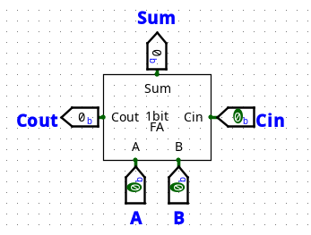

$$
\begin{matrix}
\small \quad\;\; 1\,1\,1 \\
\quad\quad 0010 \\
\quad\underline{+\; 0111} \\
\quad\;\;\, 01001
\end{matrix}
$$

|$A$|$B$|$Cin$|$Cout$|$Sum$|
|-|-|-|-|-|
|0|0|0|0|0|
|0|0|1|0|1|
|0|1|0|0|1|
|0|1|1|1|0|
|1|0|0|0|1|
|1|0|1|1|0|
|1|1|0|1|0|
|1|1|1|1|1|

$$
\begin{align*}
Sum &= A^{\prime}B^{\prime}Cin + A^{\prime}BCin^{\prime} + AB^{\prime}Cin^{\prime} + ABCin \\
    &= A \oplus B \oplus Cin
\end{align*}
$$

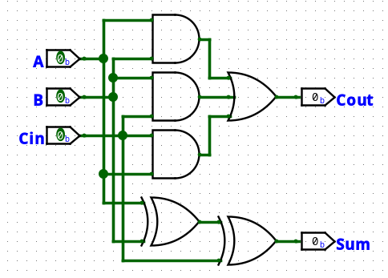

$$
\begin{align*}
Cout &= A^{\prime}BCin + AB^{\prime}Cin + ABCin^{\prime} + ABCin \\
     &= AB + BCin + CinA
\end{align*}
$$

##### Ripple carry adder

- 덧셈의 원리를 이용하여 1-bit full adder를 연결시켜 4-bit adder를 만든다.

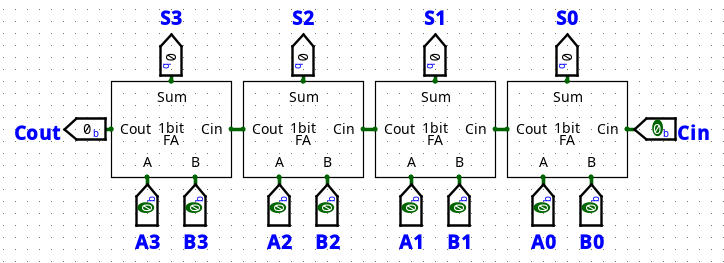

- FA를 연결하여 구현하는 것을 Ripple Carry Adder라고 한다.

- 단점: gate delay가 있기 때문에 carry를 받는데 시간이 걸린다.

- Carry Lookahead Adder를 사용하여 이를 보완한다.

## HW3

### 4.9

- $F(a,b,c)=abc^{\prime} + b^{\prime}$

|$a$|$b$|$c$|$F$|
|-|-|-|-|
|0|0|0|1|
|0|0|1|1|
|0|1|0|0|
|0|1|1|0|
|1|0|0|1|
|1|0|1|1|
|1|1|0|1|
|1|1|1|0|

##### a

- Express $F$ as a minterm expansion. (Use $m$-notation)

- $F(a,b,c) = \sum m(0,1,4,5,6)$

##### b

- Express $F$ as a maxterm expansion. (Use $M$-notation)

- $F(a,b,c) = \Pi M(2,3,7)$

##### c

- Express $F^{\prime}$ as a minterm expansion. (Use $m$-notation)

- $F^{\prime}(a,b,c) = \sum m(2,3,7)$

##### d

- Express $F^{\prime}$ as a maxterm expansion. (Use $M$-notation)

- $F^{\prime}(a,b,c) = \Pi M(0,1,4,5,6)$

### 4.25

- Four chairs are placed in a row: A B C D

- Each chair may be occupied (1) or empty (0).

- Give the minterm and maxterm expansion for each logic function described

##### a

- $F(A,B,C,D)$ is 1 iff there are no adjacent empty chairs

| |$A$|$B$|$C$|$D$|$F$|
|-|-|-|-|-|-|
|0|0|0|0|0|0|
|1|0|0|0|1|0|
|2|0|0|1|0|0|
|3|0|0|1|1|0|
|4|0|1|0|0|0|
|5|0|1|0|1|1|
|6|0|1|1|0|1|
|7|0|1|1|1|1|
|8|1|0|0|0|0|
|9|1|0|0|1|0|
|10|1|0|1|0|1|
|11|1|0|1|1|1|
|12|1|1|0|0|0|
|13|1|1|0|1|1|
|14|1|1|1|0|1|
|15|1|1|1|1|1|

- $F(A,B,C,D) = \sum m(5,6,7,10,11,13,14,15) = \Pi M(0,1,2,3,4,8,9)$

##### b

- $G(A,B,C,D)$ is 1 iff the chairs on the ends are both empty

| |$A$|$B$|$C$|$D$|$G$|
|-|-|-|-|-|-|
|0|0|0|0|0|1|
|1|0|0|0|1|0|
|2|0|0|1|0|1|
|3|0|0|1|1|0|
|4|0|1|0|0|1|
|5|0|1|0|1|0|
|6|0|1|1|0|1|
|7|0|1|1|1|0|
|8|1|0|0|0|0|
|9|1|0|0|1|0|
|10|1|0|1|0|0|
|11|1|0|1|1|0|
|12|1|1|0|0|0|
|13|1|1|0|1|0|
|14|1|1|1|0|0|
|15|1|1|1|1|0|

- $G(A,B,C,D) = \sum m(0,2,4,6) = \Pi M(2,3,5,7,8,9,10,11,12,13,14,15)$

##### c

- $H(A,B,C,D) is 1 iff at least three chairs are full

| |$A$|$B$|$C$|$D$|$H$|
|-|-|-|-|-|-|
|0|0|0|0|0|0|
|1|0|0|0|1|0|
|2|0|0|1|0|0|
|3|0|0|1|1|0|
|4|0|1|0|0|0|
|5|0|1|0|1|0|
|6|0|1|1|0|0|
|7|0|1|1|1|1|
|8|1|0|0|0|0|
|9|1|0|0|1|0|
|10|1|0|1|0|0|
|11|1|0|1|1|1|
|12|1|1|0|0|0|
|13|1|1|0|1|1|
|14|1|1|1|0|1|
|15|1|1|1|1|1|

- $H(A,B,C,D) = \sum m(7,11,13,14,15) = \Pi M(0,1,2,3,4,5,6,8,9,10,12)$

##### d

- $J(A,B,C,D)$ is 1 iff there are more people sitting in the left two chairs than in the right two chairs

| |$A$|$B$|$C$|$D$|$J$|
|-|-|-|-|-|-|
|0|0|0|0|0|0|
|1|0|0|0|1|0|
|2|0|0|1|0|0|
|3|0|0|1|1|0|
|4|0|1|0|0|1|
|5|0|1|0|1|0|
|6|0|1|1|0|0|
|7|0|1|1|1|0|
|8|1|0|0|0|1|
|9|1|0|0|1|0|
|10|1|0|1|0|0|
|11|1|0|1|1|0|
|12|1|1|0|0|1|
|13|1|1|0|1|1|
|14|1|1|1|0|1|
|15|1|1|1|1|0|

- $J(A,B,C,D) = \sum m(4,8,12,13,14) = \Pi M(0,1,2,3,5,6,7,9,10,11,15)$

### Logisim을 이용한 4-bit Full Adder 구현

- 1-bit Full Adder를 사용하여 구현

- 음수는 2's complement 방법

##### 1-bit Full Adder

##### 4-bit Full Adder

##### a

- $(+3) +(+4) = +7$

- $3 = 0011_2$, $4 = 0100_2$, $7=0111_2$

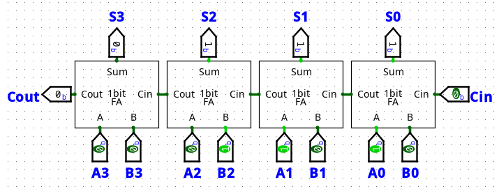

##### b

- $(+5)+(+6)=+11$

- $5=0101_2$, $6=0110_2$, $11=1011_2$

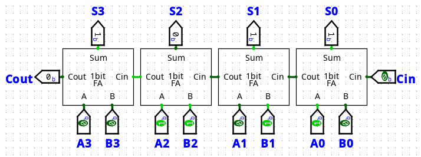

##### c

- $(+5)+(-6)=-1$

- $5=0101_2$, $6=0110_2;\,-6=1010_2$, $1=0001_2;\,-1=1111_2$

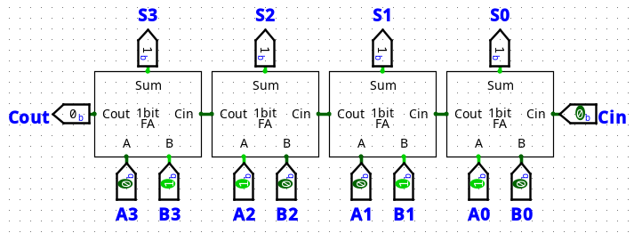

##### d

- $(-5)+(+6)=+1$

- $5=0101_2;\,-5=1011_2$, $6=0110_2$, $1=0001_2$

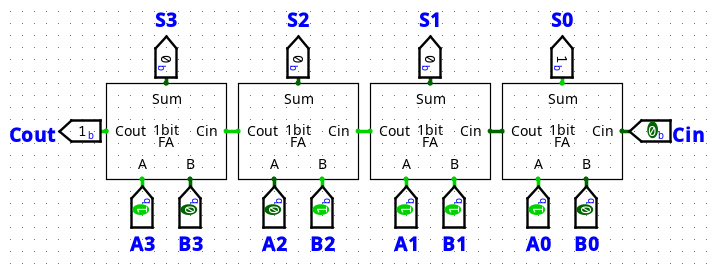

##### e

- $(-3)+(-4)=-7$

- $3=0011_2;\,-3=1101_2$, $4=0100_2;\,-4=1100_2$, $7=0111_2;\,-7=1001_2$

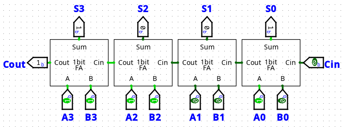

##### f

- $(-5)+(-6)=-11$

- $5=0101_2;\,-5=1011_2$, $6=0110_2;\,-6=1010_2$, $11=01011_2;\,-11=10101_2$

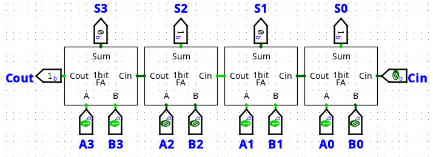

