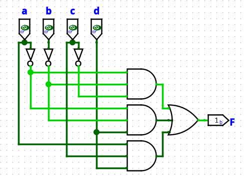
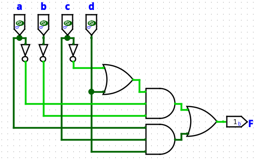

# Ch5 Karnaugh Maps
{: .no_toc }

  

	Table of contents
  

{: .fs-3 .text-delta }

- TOC
{:toc}

---

## Color
{: .no_toc }

<table>
	<tr>
		<th class="map1">1</th>
		<th class="map2">2</th>
		<th class="map3">4</th>
		<th class="map4">8</th>
	</tr>
	<tr>
		<th class="map2">2</th>
		<td class="map2_2">2, 2</td>
		<td class="map2_3">2, 4</td>
		<td class="map2_4">2, 8</td>
	</tr>
	<tr>
		<th class="map3">4</th>
		<td></td>
		<td class="map3_3">4, 4</td>
		<td class="map3_4">4, 8</td>
	</tr>
	<tr>
		<th class="map4">8</th>
		<td></td>
		<td></td>
		<td class="map4_4">8, 8</td>
	</tr>
	<tr>
		<th class="map3_3">4, 4</th>
		<td style="background:#ddffee">4,4,2</td>
	</tr>
</table>

---

## 5.1 Minimum Forms of Switching Functions

### Example

- $F(a,b,c) = \sum m(0,1,2,5,6,7)$

$$
\begin{align*}
F &= a^{\prime}b^{\prime}c^{\prime} + a^{\prime}b^{\prime}c + a^{\prime}bc^{\prime} + ab^{\prime}c + abc^{\prime} + abc \\
  &= a^{\prime}b^{\prime} + a^{\prime}c^{\prime} + ab + ac \\
  &= (a \oplus b)^{\prime} + (a \oplus c)^{\prime} \\
  &= ((a \oplus b)(a \oplus c))^{\prime} \\
  &= (a \oplus bc)^{\prime}
\end{align*}
$$

### Main Idea

$$
\begin{matrix}
ab^{\prime}cd^{\prime} &+& ab^{\prime}cd &=& ab^{\prime}c \\
101{\color{red}0} & & 101{\color{red}1} &=& 101{\color{red}-}
\end{matrix}
$$

$$
\begin{matrix}
ab^{\prime}c &+& abc &=& ac \\
1{\color{red}0}1- &+& 1{\color{red}1}1- &=& 1{\color{red}-}1-
\end{matrix}
$$

- 1bit 차이 나야 Uniting이 가능하다.

## 5.2 Two- and Three- Variable Karnaugh Maps

- Two level

- variable 5개까지

### Step

##### Sum of product

1. 카르노 맵을 그린다.

2. 값이 1인 인접한 셀을 $2^i(0\le i \le n,\, n\text{은 variable 개수})$개씩 크게 묶는다.

	- wrap around된 것도 인접한 셀로 취급한다.

3. 값이 1인 셀이 모두 커버가 될 때까지 2.를 반복한다.

4. 식으로 표현한다.

##### Product of sum

1. 카르노 맵을 그린다.

2. 값이 0인 인접한 셀을 $2^i(0\le i \le n,\, n\text{은 variable 개수})$개씩 크게 묶는다.

	- wrap around된 것도 인접한 셀로 취급한다.

3. 값이 0인 셀이 모두 커버가 될 때까지 2.를 반복한다.

4. 식으로 표현한다.

### Two variable karnaugh map

<table>
    <thead>
    	<tr>
			<th class='backslash'>
$A$
$B$</th>
            <th>0</th>
            <th>1</th>
         </tr>
    </thead>
    <tbody>
         <tr>
            <th>0</th>
            <td>$m_0, M_0$</td>
            <td>$m_2, M_2$</td>
        </tr>
         <tr>
            <th>1</th>
            <td>$m_1, M_1$</td>
            <td>$m_3, M_3$</td>
        </tr>
    </tbody>
</table>

- 모든 셀이 인접한 셀과 1bit 차이 난다.

##### Example

|$A$|$B$|$F$|
|-|-|-|
|0|0|1|
|0|1|1|
|1|0|0|
|1|1|0|

- Sum of product

	$$
	\begin{matrix}
	A^{\prime}B^{\prime} &+& A^{\prime}B &=& A^{\prime} \\
	0{\color{red}0} &+& 0{\color{red}1} &=& 0{\color{red}-}
	\end{matrix}
	$$

	<table>
		<thead>
			<tr>
				<th class='backslash'>
$A$
$B$</th>
				<th style="color:red">$0$</th>
				<th>$1$</th>
			 </tr>
		</thead>
		<tbody>
			 <tr>
				<th>0</th>
				<td class="map2">1</td>
				<td>0</td>
			</tr>
			 <tr>
				<th>1</th>
				<td class="map2">1</td>
				<td>0</td>
			</tr>
		</tbody>
	</table>

	- 값이 1인 인접한 항응 묶어 $F=A^{\prime}$를 바로 구할 수 있다.

### Three variable karnaugh map

<table>
    <thead>
    	<tr>
			<th class='backslash'>
$A$
$BC$</th>
            <th>0</th>
            <th>1</th>
         </tr>
    </thead>
    <tbody>
         <tr>
            <th>00</th>
            <td>$m_0, M_0$</td>
            <td>$m_4, M_4$</td>
        </tr>
         <tr>
            <th>01</th>
            <td>$m_1, M_1$</td>
            <td>$m_5, M_5$</td>
        </tr>
         <tr>
            <th>11</th>
            <td>$m_3, M_3$</td>
            <td>$m_7, M_7$</td>
        </tr>
         <tr>
            <th>10</th>
            <td>$m_2, M_2$</td>
            <td>$m_6, M_6$</td>
        </tr>
    </tbody>
</table>

- 모든 셀이 인접한 셀과 1bit 차이나도록 $BC$를 00, 01, 11, 10 순서로 배치한다.

##### Example 1

|$A$|$B$|$C$|$F$|
|-|-|-|-|
|0|0|0|0|
|0|0|1|0|
|0|1|0|1|
|0|1|1|1|
|1|0|0|1|
|1|0|1|0|
|1|1|0|1|
|1|1|1|0|

- Sum of product

	<table>
		<thead>
			<tr>
				<th class='backslash'>
$A$
$BC$</th>
				<th>0</th>
				<th>1</th>
			 </tr>
		</thead>
		<tbody>
			 <tr>
				<th>00</th>
				<td>0</td>
				<td class="map2">1</td>
			</tr>
			 <tr>
				<th>01</th>
				<td>0</td>
				<td>0</td>
			</tr>
			 <tr>
				<th>11</th>
				<td class="map2">1</td>
				<td>0</td>
			</tr>
			 <tr>
				<th>10</th>
				<td class="map2">1</td>
				<td class="map2">1</td>
			</tr>
		</tbody>
	</table>

	- $F = A^{\prime}B + AC^{\prime}$

##### Example 2. Consensus theorem

- Sum of product

	<table>
		<thead>
			<tr>
				<th class='backslash'>
$A$
$BC$</th>
				<th>0</th>
				<th>1</th>
			 </tr>
		</thead>
		<tbody>
			 <tr>
				<th>00</th>
				<td>0</td>
				<td>0</td>
			</tr>
			 <tr>
				<th>01</th>
				<td class="map2">1</td>
				<td>0</td>
			</tr>
			 <tr>
				<th>11</th>
				<td class="map2_2">1</td>
				<td class="map2_2">1</td>
			</tr>
			 <tr>
				<th>10</th>
				<td>0</td>
				<td class="map2">1</td>
			</tr>
		</tbody>
	</table>

	- $F = AB + BC + A^{\prime}C$

	<table>
		<thead>
			<tr>
				<th class='backslash'>
$A$
$BC$</th>
				<th>0</th>
				<th>1</th>
			 </tr>
		</thead>
		<tbody>
			 <tr>
				<th>00</th>
				<td>0</td>
				<td>0</td>
			</tr>
			 <tr>
				<th>01</th>
				<td class="map2">1</td>
				<td>0</td>
			</tr>
			 <tr>
				<th>11</th>
				<td class="map2">1</td>
				<td class="map2">1</td>
			</tr>
			 <tr>
				<th>10</th>
				<td>0</td>
				<td class="map2">1</td>
			</tr>
		</tbody>
	</table>

	- $F = AB + A^{\prime}C$

##### Example 3

> [Color](#color) 예외

- Sum of product

	<table>
		<thead>
			<tr>
				<th class='backslash'>
$A$
$BC$</th>
				<th>0</th>
				<th>1</th>
			 </tr>
		</thead>
		<tbody>
			 <tr>
				<th>00</th>
				<td class="map1">1</td>
				<td>0</td>
			</tr>
			 <tr>
				<th>01</th>
				<td class="map1">1</td>
				<td class="map2">1</td>
			</tr>
			 <tr>
				<th>11</th>
				<td>0</td>
				<td class="map2">1</td>
			</tr>
			 <tr>
				<th>10</th>
				<td class="map3">1</td>
				<td class="map3">1</td>
			</tr>
		</tbody>
	</table>

	<table>
		<thead>
			<tr>
				<th class='backslash'>
$A$
$BC$</th>
				<th>0</th>
				<th>1</th>
			 </tr>
		</thead>
		<tbody>
			 <tr>
				<th>00</th>
				<td class="map1">1</td>
				<td>0</td>
			</tr>
			 <tr>
				<th>01</th>
				<td class="map2">1</td>
				<td class="map2">1</td>
			</tr>
			 <tr>
				<th>11</th>
				<td>0</td>
				<td class="map3">1</td>
			</tr>
			 <tr>
				<th>10</th>
				<td class="map1">1</td>
				<td class="map3">1</td>
			</tr>
		</tbody>
	</table>

## 5.3 Four-Variable Karnaugh Maps

<table>
    <thead>
    	<tr>
			<th class='backslash'>
$AB$
$CD$</th>
            <th>00</th>
            <th>01</th>
            <th>11</th>
            <th>10</th>
         </tr>
    </thead>
    <tbody>
         <tr>
            <th>00</th>
            <td>$m_0, M_0$</td>
            <td>$m_4, M_4$</td>
            <td>$m_{12}, M_{12}$</td>
            <td>$m_8, M_8$</td>
        </tr>
         <tr>
            <th>01</th>
            <td>$m_1, M_1$</td>
            <td>$m_5, M_5$</td>
            <td>$m_{13}, M_{13}$</td>
            <td>$m_9, M_9$</td>
        </tr>
         <tr>
            <th>11</th>
            <td>$m_3, M_3$</td>
            <td>$m_7, M_7$</td>
            <td>$m_{15}, M_{15}$</td>
            <td>$m_{11}, M_{11}$</td>
        </tr>
         <tr>
            <th>10</th>
            <td>$m_2, M_2$</td>
            <td>$m_6, M_6$</td>
            <td>$m_{14}, M_{14}$</td>
            <td>$m_{10}, M_{10}$</td>
        </tr>
    </tbody>
</table>

- 모든 셀이 인접한 셀과 1bit 차이나도록 $AB$, $CD$를 00, 01, 11, 10 순서로 배치한다.

### Example

##### Example 1. Don't care term

- $f = \sum m(1,3,5,7,9) + \sum d(6, 12, 13)$

- Sum of product

	<table>
		<thead>
			<tr>
				<th class='backslash'>
$AB$
$CD$</th>
				<th>00</th>
				<th>01</th>
				<th>11</th>
				<th>10</th>
			 </tr>
		</thead>
		<tbody>
			 <tr>
				<th>00</th>
				<td></td>
				<td></td>
				<td></td>
				<td></td>
			</tr>
			 <tr>
				<th>01</th>
				<td class="map2_3">1</td>
				<td class="map3">1</td>
				<td></td>
				<td class="map2">1</td>
			</tr>
			 <tr>
				<th>11</th>
				<td class="map3">1</td>
				<td class="map3">1</td>
				<td></td>
				<td></td>
			</tr>
			 <tr>
				<th>10</th>
				<td></td>
				<td></td>
				<td></td>
				<td></td>
			</tr>
		</tbody>
	</table>

	- $f = A^{\prime}D + B^{\prime}C^{\prime}D$

	<table>
		<thead>
			<tr>
				<th class='backslash'>
$AB$
$CD$</th>
				<th>00</th>
				<th>01</th>
				<th>11</th>
				<th>10</th>
			 </tr>
		</thead>
		<tbody>
			 <tr>
				<th>00</th>
				<td></td>
				<td></td>
				<td>X</td>
				<td></td>
			</tr>
			 <tr>
				<th>01</th>
				<td class="map2_3">1</td>
				<td class="map2_3">1</td>
				<td class="map3">X</td>
				<td class="map3">1</td>
			</tr>
			 <tr>
				<th>11</th>
				<td class="map2">1</td>
				<td class="map2">1</td>
				<td></td>
				<td></td>
			</tr>
			 <tr>
				<th>10</th>
				<td></td>
				<td>X</td>
				<td></td>
				<td></td>
			</tr>
		</tbody>
	</table>

	- $f = A^{\prime}D + C^{\prime}D$

##### Example 2

- Sum of product

	<table>
		<thead>
			<tr>
				<th class='backslash'>
$wx$
$yz$</th>
				<th>00</th>
				<th>01</th>
				<th>11</th>
				<th>10</th>
			 </tr>
		</thead>
		<tbody>
			 <tr>
				<th>00</th>
				<td class="map2_3">1</td>
				<td class="map2">1</td>
				<td>0</td>
				<td class="map3">1</td>
			</tr>
			 <tr>
				<th>01</th>
				<td>0</td>
				<td>0</td>
				<td>0</td>
				<td>0</td>
			</tr>
			 <tr>
				<th>11</th>
				<td class="map3">1</td>
				<td>0</td>
				<td class="map2">1</td>
				<td class="map2_3">1</td>
			</tr>
			 <tr>
				<th>10</th>
				<td class="map3_3">1</td>
				<td>0</td>
				<td>0</td>
				<td class="map3_3">1</td>
			</tr>
		</tbody>
	</table>

	- $F = x^{\prime}z^{\prime} + w^{\prime}y^{\prime}z^{\prime} + x^{\prime}z^{\prime} + wyz$

	- AND: 4, OR:1

- Product of sum

	<table>
		<thead>
			<tr>
				<th class='backslash'>
$wx$
$yz$</th>
				<th>00</th>
				<th>01</th>
				<th>11</th>
				<th>10</th>
			 </tr>
		</thead>
		<tbody>
			 <tr>
				<th>00</th>
				<td>1</td>
				<td>1</td>
				<td class="map2">0</td>
				<td>1</td>
			</tr>
			 <tr>
				<th>01</th>
				<td class="map3">0</td>
				<td class="map3">0</td>
				<td class="map3">0</td>
				<td class="map3">0</td>
			</tr>
			 <tr>
				<th>11</th>
				<td>1</td>
				<td class="map2">0</td>
				<td>1</td>
				<td>1</td>
			</tr>
			 <tr>
				<th>10</th>
				<td>1</td>
				<td class="map2">0</td>
				<td class="map2">0</td>
				<td>1</td>
			</tr>
		</tbody>
	</table>

	- $F = (y+z^{\prime})(w+x^{\prime}+y^{\prime})(w^{\prime}+x^{\prime}+z)$

	- AND: 1, OR:3 SOP보다 gate 하나 적게 사용

	$$
	\begin{align*}
	F &= (F^{\prime})^{\prime} \\
	  &= (y^{\prime}z + w^{\prime}xy + wxz^{\prime})^{\prime} \\
	  &= (y+z^{\prime})(w+x^{\prime}+y^{\prime})(w^{\prime}+x^{\prime}+z)
	\end{align*}
	$$

## 5.4 Determination of Minimum Expressions Using Essential Prime Implicants

### Term

##### Implicant of $F$

- Any single 1 or any grouop of 1' which can be cambined together on a map of the function $F$

##### Prime Implicant

- The implicant cannot be combined with another term to eliminate a variable

##### Essential prime implicant

- If a minterm is covered by only one prime implicant, that prime implicant is essential

### Step

1. prime implicant를 찾는다.

2. essential prime implicant를 포함시킨다.

3. 남아 있는 1에 대해서 gate의 개수가 최소가 되도록 묶는다.

### Example

##### Example 1. Prime implicant

> [Color](#color) 예외

<table>
	<thead>
		<tr>
			<th class='backslash'>
$ab$
$cd$</th>
			<th>00</th>
			<th>01</th>
			<th>11</th>
			<th>10</th>
		 </tr>
	</thead>
	<tbody>
		 <tr>
			<th>00</th>
			<td></td>
			<td></td>
			<td>1</td>
			<td></td>
		</tr>
		 <tr>
			<th>01</th>
			<td class="map1">1</td>
			<td class="map1">1</td>
			<td></td>
			<td></td>
		</tr>
		 <tr>
			<th>11</th>
			<td class="map2">1</td>
			<td class="map2">1</td>
			<td></td>
			<td></td>
		</tr>
		 <tr>
			<th>10</th>
			<td></td>
			<td></td>
			<td></td>
			<td></td>
		</tr>
	</tbody>
</table>

- implicant 2개, prime implicant는 아님

<table>
	<thead>
		<tr>
			<th class='backslash'>
$ab$
$cd$</th>
			<th>00</th>
			<th>01</th>
			<th>11</th>
			<th>10</th>
		 </tr>
	</thead>
	<tbody>
		 <tr>
			<th>00</th>
			<td></td>
			<td></td>
			<td>1</td>
			<td></td>
		</tr>
		 <tr>
			<th>01</th>
			<td class="map3">1</td>
			<td class="map3">1</td>
			<td></td>
			<td></td>
		</tr>
		 <tr>
			<th>11</th>
			<td class="map3">1</td>
			<td class="map3">1</td>
			<td></td>
			<td></td>
		</tr>
		 <tr>
			<th>10</th>
			<td></td>
			<td></td>
			<td></td>
			<td></td>
		</tr>
	</tbody>
</table>

- implicant 1개, prime implicant

##### Example 2. Essential prime implicant

<table>
	<thead>
		<tr>
			<th class='backslash'>
$ab$
$cd$</th>
			<th>00</th>
			<th>01</th>
			<th>11</th>
			<th>10</th>
		 </tr>
	</thead>
	<tbody>
		 <tr>
			<th>00</th>
			<td></td>
			<td class="map3">1</td>
			<td class="map3_3">1</td>
			<td></td>
		</tr>
		 <tr>
			<th>01</th>
			<td class="map2_2">1</td>
			<td class="map2_3">1</td>
			<td class="map3_3">1</td>
			<td></td>
		</tr>
		 <tr>
			<th>11</th>
			<td class="map2_2">1</td>
			<td></td>
			<td class="map3_3">1</td>
			<td class="map2_3">1</td>
		</tr>
		 <tr>
			<th>10</th>
			<td></td>
			<td></td>
			<td class="map3_3">1</td>
			<td class="map3">1</td>
		</tr>
	</tbody>
</table>

- prime implicant 6개

<table>
	<thead>
		<tr>
			<th class='backslash'>
$ab$
$cd$</th>
			<th>00</th>
			<th>01</th>
			<th>11</th>
			<th>10</th>
		 </tr>
	</thead>
	<tbody>
		 <tr>
			<th>00</th>
			<td></td>
			<td class="map3">1</td>
			<td class="map3">1</td>
			<td></td>
		</tr>
		 <tr>
			<th>01</th>
			<td>1</td>
			<td class="map3">1</td>
			<td class="map3">1</td>
			<td></td>
		</tr>
		 <tr>
			<th>11</th>
			<td>1</td>
			<td></td>
			<td class="map3">1</td>
			<td class="map3">1</td>
		</tr>
		 <tr>
			<th>10</th>
			<td></td>
			<td></td>
			<td class="map3">1</td>
			<td class="map3">1</td>
		</tr>
	</tbody>
</table>

- essential prime implicant 2개

<table>
	<thead>
		<tr>
			<th class='backslash'>
$ab$
$cd$</th>
			<th>00</th>
			<th>01</th>
			<th>11</th>
			<th>10</th>
		 </tr>
	</thead>
	<tbody>
		 <tr>
			<th>00</th>
			<td></td>
			<td class="map3">1</td>
			<td class="map3">1</td>
			<td></td>
		</tr>
		 <tr>
			<th>01</th>
			<td class="map2">1</td>
			<td class="map3">1</td>
			<td class="map3">1</td>
			<td></td>
		</tr>
		 <tr>
			<th>11</th>
			<td class="map2">1</td>
			<td></td>
			<td class="map3">1</td>
			<td class="map3">1</td>
		</tr>
		 <tr>
			<th>10</th>
			<td></td>
			<td></td>
			<td class="map3">1</td>
			<td class="map3">1</td>
		</tr>
	</tbody>
</table>

- 최종 간소화

##### Example 3. Essential prime implicant

<table>
	<thead>
		<tr>
			<th class='backslash'>
$ab$
$cd$</th>
			<th>00</th>
			<th>01</th>
			<th>11</th>
			<th>10</th>
		 </tr>
	</thead>
	<tbody>
		 <tr>
			<th>00</th>
			<td class="map2_3">1</td>
			<td class="map3">1</td>
			<td></td>
			<td></td>
		</tr>
		 <tr>
			<th>01</th>
			<td class="map3">1</td>
			<td class="map2_3">1</td>
			<td></td>
			<td></td>
		</tr>
		 <tr>
			<th>11</th>
			<td></td>
			<td class="map2_2">1</td>
			<td class="map2_2">1</td>
			<td class="map2">1</td>
		</tr>
		 <tr>
			<th>10</th>
			<td class="map2">1</td>
			<td></td>
			<td></td>
			<td></td>
		</tr>
	</tbody>
</table>

- prime implicant 5개

<table>
	<thead>
		<tr>
			<th class='backslash'>
$ab$
$cd$</th>
			<th>00</th>
			<th>01</th>
			<th>11</th>
			<th>10</th>
		 </tr>
	</thead>
	<tbody>
		 <tr>
			<th>00</th>
			<td class="map2_3">1</td>
			<td class="map3">1</td>
			<td></td>
			<td></td>
		</tr>
		 <tr>
			<th>01</th>
			<td class="map3">1</td>
			<td class="map3">1</td>
			<td></td>
			<td></td>
		</tr>
		 <tr>
			<th>11</th>
			<td></td>
			<td>1</td>
			<td class="map2">1</td>
			<td class="map2">1</td>
		</tr>
		 <tr>
			<th>10</th>
			<td class="map2">1</td>
			<td></td>
			<td></td>
			<td></td>
		</tr>
	</tbody>
</table>

- essential prime implicant 3개

<table>
	<thead>
		<tr>
			<th class='backslash'>
$ab$
$cd$</th>
			<th>00</th>
			<th>01</th>
			<th>11</th>
			<th>10</th>
		 </tr>
	</thead>
	<tbody>
		 <tr>
			<th>00</th>
			<td class="map2_3">1</td>
			<td class="map3">1</td>
			<td></td>
			<td></td>
		</tr>
		 <tr>
			<th>01</th>
			<td class="map3">1</td>
			<td class="map2_3">1</td>
			<td></td>
			<td></td>
		</tr>
		 <tr>
			<th>11</th>
			<td></td>
			<td class="map2">1</td>
			<td class="map2">1</td>
			<td class="map2">1</td>
		</tr>
		 <tr>
			<th>10</th>
			<td class="map2">1</td>
			<td></td>
			<td></td>
			<td></td>
		</tr>
	</tbody>
</table>

- $F = a^{\prime} + a^{\prime}b^{\prime}d^{\prime} + a^{\prime}bd + acd$

<table>
	<thead>
		<tr>
			<th class='backslash'>
$ab$
$cd$</th>
			<th>00</th>
			<th>01</th>
			<th>11</th>
			<th>10</th>
		 </tr>
	</thead>
	<tbody>
		 <tr>
			<th>00</th>
			<td class="map2_3">1</td>
			<td class="map3">1</td>
			<td></td>
			<td></td>
		</tr>
		 <tr>
			<th>01</th>
			<td class="map3">1</td>
			<td class="map3">1</td>
			<td></td>
			<td></td>
		</tr>
		 <tr>
			<th>11</th>
			<td></td>
			<td class="map2">1</td>
			<td class="map2_2">1</td>
			<td class="map2">1</td>
		</tr>
		 <tr>
			<th>10</th>
			<td class="map2">1</td>
			<td></td>
			<td></td>
			<td></td>
		</tr>
	</tbody>
</table>

- $F = a^{\prime} + a^{\prime}b^{\prime}d^{\prime} + bcd + acd$

## 5.5 Five-Variable Karnaugh Maps

<table>
	<thead>
		<tr>
			<th>$a$</th>
			<td class='slash'>1
0
</td>
		</tr>
	</thead>
</table>

<table>
	<thead>
		<tr>
			<th class='backslash'>
$bc$
$de$</th>
			<th>00</th>
			<th>01</th>
			<th>11</th>
			<th>10</th>
		</tr>
	</thead>
	<tbody>
		<tr>
			<th>00</th>
			<td class='slash'>16
0
</td>
			<td class='slash'>20
4
</td>
			<td class='slash'>28
12
</td>
			<td class='slash'>24
8
</td>
		</tr>
		<tr>
			<th>01</th>
			<td class='slash'>17
1
</td>
			<td class='slash'>21
5
</td>
			<td class='slash'>29
13
</td>
			<td class='slash'>25
9
</td>
		</tr>
		<tr>
			<th>11</th>
			<td class='slash'>19
3
</td>
			<td class='slash'>23
7
</td>
			<td class='slash'>31
15
</td>
			<td class='slash'>27
11
</td>
		</tr>
		<tr>
			<th>10</th>
			<td class='slash'>18
2
</td>
			<td class='slash'>22
6
</td>
			<td class='slash'>30
14
</td>
			<td class='slash'>26
10
</td>
		</tr>
	</tbody>
</table>

### Example

- $F(a,b,c,d,e) = \sum m(0,1,4,5,13,15,20,21,22,23,24,26,28,30,31)$

<table>
	<thead>
		<tr>
			<th class='backslash'>
$bc$
$de$</th>
			<th>00</th>
			<th>01</th>
			<th>11</th>
			<th>10</th>
		</tr>
	</thead>
	<tbody>
		<tr>
			<th>00</th>
			<td class='slash' style="background-image: linear-gradient(to top left, #eeffee 49%, grey, white 51%)">
1
</td>
			<td class='slash map3_3'>1
1
</td>
			<td class='slash' style="background-image: linear-gradient(to top left, white 49%, grey, #eeffee 51%)">1

</td>
			<td class='slash' style="background-image: linear-gradient(to top left, white 49%, grey, #eeffee 51%)">1

</td>
		</tr>
		<tr>
			<th>01</th>
			<td class='slash' style="background-image: linear-gradient(to top left, #eeffee 49%, grey, white 51%)">
1
</td>
			<td class='slash' style="background-image: linear-gradient(to top left, #ddffee 49%, grey, #ddffdd 51%)">1
1
</td>
			<td class='slash' style="background-image: linear-gradient(to top left, #ddddff 49%, grey, white 51%)">
1
</td>
			<td class='slash'>

</td>
		</tr>
		<tr>
			<th>11</th>
			<td class='slash'>

</td>
			<td class='slash' style="background-image: linear-gradient(to top left, white 49%, grey, #ddffdd 51%)">1

</td>
			<td class='slash' style="background-image: linear-gradient(to top left, #ddddff 49%, grey, #eeffff 51%)">1
1
</td>
			<td class='slash'>

</td>
		</tr>
		<tr>
			<th>10</th>
			<td class='slash'>

</td>
			<td class='slash' style="background-image: linear-gradient(to top left, white 49%, grey, #ddffdd 51%)">1

</td>
			<td class='slash' style="background-image: linear-gradient(to top left, white 49%, grey, #ddffdd 51%)">1

</td>
			<td class='slash' style="background-image: linear-gradient(to top left, white 49%, grey, #eeffee 51%)">1

</td>
		</tr>
	</tbody>
</table>

- prime implicant 8개

<table>
	<thead>
		<tr>
			<th class='backslash'>
$bc$
$de$</th>
			<th>00</th>
			<th>01</th>
			<th>11</th>
			<th>10</th>
		</tr>
	</thead>
	<tbody>
		<tr>
			<th>00</th>
			<td class='slash' style="background-image: linear-gradient(to top left, #eeffee 49%, grey, white 51%)">
1
</td>
			<td class='slash' style="background-image: linear-gradient(to top left, #eeffee 49%, grey, grey, white 51%)">1
1
</td>
			<td class='slash' style="background-image: linear-gradient(to top left, white 49%, grey, #eeffee 51%)">1

</td>
			<td class='slash' style="background-image: linear-gradient(to top left, white 49%, grey, #eeffee 51%)">1

</td>
		</tr>
		<tr>
			<th>01</th>
			<td class='slash' style="background-image: linear-gradient(to top left, #eeffee 49%, grey, white 51%)">
1
</td>
			<td class='slash' style="background-image: linear-gradient(to top left, #eeffee 49%, grey, white 51%)">1
1
</td>
			<td class='slash'>
1
</td>
			<td class='slash'>

</td>
		</tr>
		<tr>
			<th>11</th>
			<td class='slash'>

</td>
			<td class='slash'>1

</td>
			<td class='slash'>1
1
</td>
			<td class='slash'>

</td>
		</tr>
		<tr>
			<th>10</th>
			<td class='slash'>

</td>
			<td class='slash'>1

</td>
			<td class='slash' style="background-image: linear-gradient(to top left, white 49%, grey, #eeffee 51%)">1

</td>
			<td class='slash' style="background-image: linear-gradient(to top left, white 49%, grey, #eeffee 51%)">1

</td>
		</tr>
	</tbody>
</table>

- essential prime implicant 2개

<table>
	<thead>
		<tr>
			<th class='backslash'>
$bc$
$de$</th>
			<th>00</th>
			<th>01</th>
			<th>11</th>
			<th>10</th>
		</tr>
	</thead>
	<tbody>
		<tr>
			<th>00</th>
			<td class='slash' style="background-image: linear-gradient(to top left, #eeffee 49%, grey, white 51%)">
1
</td>
			<td class='slash' style="background-image: linear-gradient(to top left, #ddffdd 49%, grey, grey, #eeffee 51%)">1
1
</td>
			<td class='slash' style="background-image: linear-gradient(to top left, white 49%, grey, #eeffee 51%)">1

</td>
			<td class='slash' style="background-image: linear-gradient(to top left, white 49%, grey, #eeffee 51%)">1

</td>
		</tr>
		<tr>
			<th>01</th>
			<td class='slash' style="background-image: linear-gradient(to top left, #eeffee 49%, grey, white 51%)">
1
</td>
			<td class='slash' style="background-image: linear-gradient(to top left, #ddffdd 49%, grey, #eeffee 51%)">1
1
</td>
			<td class='slash' style="background-image: linear-gradient(to top left, #eeeeff 49%, grey, white 51%)">
1
</td>
			<td class='slash'>

</td>
		</tr>
		<tr>
			<th>11</th>
			<td class='slash'>

</td>
			<td class='slash' style="background-image: linear-gradient(to top left, white 49%, grey, #eeffee 51%)">1

</td>
			<td class='slash' style="background-image: linear-gradient(to top left, #eeeeff 49%, grey, #eeffee 51%)">1
1
</td>
			<td class='slash'>

</td>
		</tr>
		<tr>
			<th>10</th>
			<td class='slash'>

</td>
			<td class='slash' style="background-image: linear-gradient(to top left, white 49%, grey, #eeffee 51%)">1

</td>
			<td class='slash' style="background-image: linear-gradient(to top left, white 49%, grey, #ddffdd 51%)">1

</td>
			<td class='slash' style="background-image: linear-gradient(to top left, white 49%, grey, #eeffee 51%)">1

</td>
		</tr>
	</tbody>
</table>

- $F = a^{\prime}b^{\prime}d^{\prime} + abe^{\prime} + b^{\prime}cd^{\prime} + acd + a^{\prime}bce$

<table>
	<thead>
		<tr>
			<th class='backslash'>
$bc$
$de$</th>
			<th>00</th>
			<th>01</th>
			<th>11</th>
			<th>10</th>
		</tr>
	</thead>
	<tbody>
		<tr>
			<th>00</th>
			<td class='slash' style="background-image: linear-gradient(to top left, #eeffee 49%, grey, white 51%)">
1
</td>
			<td class='slash' style="background-image: linear-gradient(to top left, #eeffee 49%, grey, grey, #eeffee 51%)">1
1
</td>
			<td class='slash' style="background-image: linear-gradient(to top left, white 49%, grey, #eeffee 51%)">1

</td>
			<td class='slash' style="background-image: linear-gradient(to top left, white 49%, grey, #eeffee 51%)">1

</td>
		</tr>
		<tr>
			<th>01</th>
			<td class='slash' style="background-image: linear-gradient(to top left, #eeffee 49%, grey, white 51%)">
1
</td>
			<td class='slash' style="background-image: linear-gradient(to top left, #eeffee 49%, grey, #eeffee 51%)">1
1
</td>
			<td class='slash' style="background-image: linear-gradient(to top left, #eeeeff 49%, grey, white 51%)">
1
</td>
			<td class='slash'>

</td>
		</tr>
		<tr>
			<th>11</th>
			<td class='slash'>

</td>
			<td class='slash' style="background-image: linear-gradient(to top left, white 49%, grey, #ddffdd 51%)">1

</td>
			<td class='slash' style="background-image: linear-gradient(to top left, #eeeeff 49%, grey, #eeffee 51%)">1
1
</td>
			<td class='slash'>

</td>
		</tr>
		<tr>
			<th>10</th>
			<td class='slash'>

</td>
			<td class='slash' style="background-image: linear-gradient(to top left, white 49%, grey, #ddffdd 51%)">1

</td>
			<td class='slash' style="background-image: linear-gradient(to top left, white 49%, grey, #ddffdd 51%)">1

</td>
			<td class='slash' style="background-image: linear-gradient(to top left, white 49%, grey, #eeffee 51%)">1

</td>
		</tr>
	</tbody>
</table>

- $F = a^{\prime}b^{\prime}d^{\prime} + abe^{\prime} + ab^{\prime}c + acd + a^{\prime}bce$

## 5.6 Other Uses of Karnaugh Maps

- k-map은 AND, OR two level로 간소화해준다.

- k-map에서 겹치는 셀은 결합법칙으로 묶을 수 있다는 의미이다.

<table>
	<thead>
		<tr>
			<th class='backslash'>
$ab$
$cd$</th>
			<th>00</th>
			<th>01</th>
			<th>11</th>
			<th>10</th>
		 </tr>
	</thead>
	<tbody>
		 <tr>
			<th>00</th>
			<td class="map2">1</td>
			<td></td>
			<td></td>
			<td></td>
		</tr>
		 <tr>
			<th>01</th>
			<td class="map2_2">1</td>
			<td></td>
			<td></td>
			<td></td>
		</tr>
		 <tr>
			<th>11</th>
			<td class="map2">1</td>
			<td></td>
			<td class='map2'>1</td>
			<td class='map2'>1</td>
		</tr>
		 <tr>
			<th>10</th>
			<td></td>
			<td></td>
			<td></td>
			<td></td>
		</tr>
	</tbody>
</table>

$$
\begin{align*}
F &= a^{\prime}b^{\prime}c^{\prime} + a^{\prime}b^{\prime}d + acd \\
  &= a^{\prime}b^{\prime}(c^{\prime}+d) + acd
\end{align*}
$$

